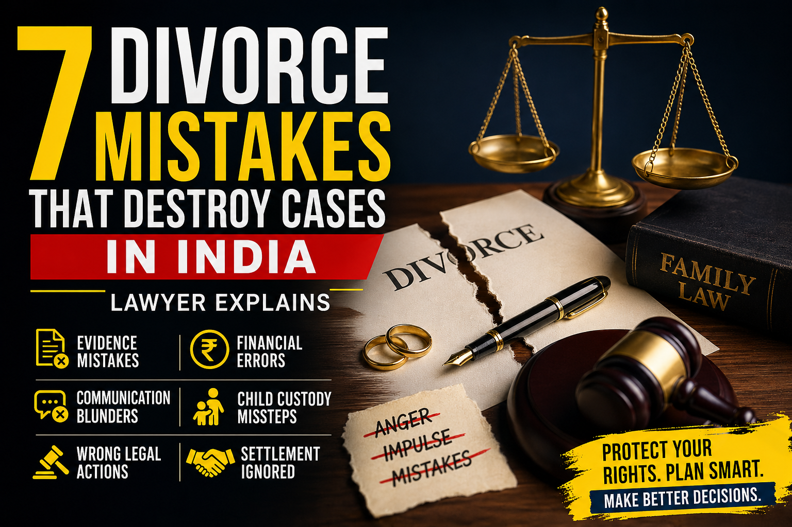

# 7 Divorce Mistakes That Destroy Cases in India: A Strategic Guide

## Table of contents

## Introduction

Matrimonial litigation in India is often described as an emotional marathon. While the law provides remedies for divorce, maintenance, and custody, the final outcome of a case is frequently decided not by the facts themselves, but by how the parties conduct themselves during the litigation. 

As a seasoned **divorce lawyer in Kolkata**, I have observed how otherwise strong cases can be weakened by impulsive decisions and procedural errors. Here are the 7 most critical mistakes that can destroy a matrimonial case in India.

## 1. Acting on Emotional Impulse
Divorce is deeply emotional, but the legal process is clinical. Sending angry text messages, emails, or making threats in the heat of the moment can create a digital trail that is difficult to explain away later. Courts value composure and factual consistency.

## 2. Inconsistent Pleading and Allegations
One of the most common mistakes is changing your "story" across different applications—such as saying one thing in a maintenance reply and another in a divorce petition. Courts look for credibility; contradictory statements are a major red flag.

## 3. Financial Concealment
With the Supreme Court’s mandatory income disclosure requirements, hiding assets or income has become a high-risk gamble. If the court discovers hidden bank accounts, property, or employment, it can lead to adverse inferences and even perjury charges. **Honest disclosure is almost always the safer legal strategy.**

## 4. Using Children as Leverage
Indian courts place the **welfare of the child** above parental hostility. Using children as bargaining tools for money or denying visitation without safety concerns can severely damage your credibility. A parent who appears child-focused and cooperative often gains the court’s trust.

## 5. Posting on Social Media
In a digital age, social media is a goldmine for evidence. Cryptic messages, luxury vacation photos, or public accusations can all be used to undermine maintenance claims or prove misconduct. During a dispute, discretion is the wisest policy. **Social media rewards impulse; courts reward restraint.**

## 6. Filing the Wrong Cases in Panic
Filing a "scattergun" of multiple complaints (498A, Domestic Violence, Maintenance, etc.) without a coherent strategy can lead to procedural chaos. Precision is stronger than panic. Each legal remedy should be selected based on clear long-term objectives.

## 7. Ignoring Settlement Until it's Too Late
Many cases could resolve far earlier through structured negotiation. Settlement is not surrender; it is a way to gain certainty today rather than uncertainty years later. Explore principled negotiation early to save time, money, and mental peace.

## Conclusion: Proof Beats Outrage

Courts rarely reward the person who shouts the loudest. They examine conduct, evidence, and practicality. Success in family court depends on composure, documentation, and the right legal strategy. Avoid impulsive decisions and build your case around proof, not anger.

---

**Advocate Prithwish Ganguli**  
House # 73, near Tank #10, behind Matri Sadan Hospital,  
EE Block, Sector II, Bidhannagar, Kolkata, West Bengal 700091  
**M.:** 99030 16246
