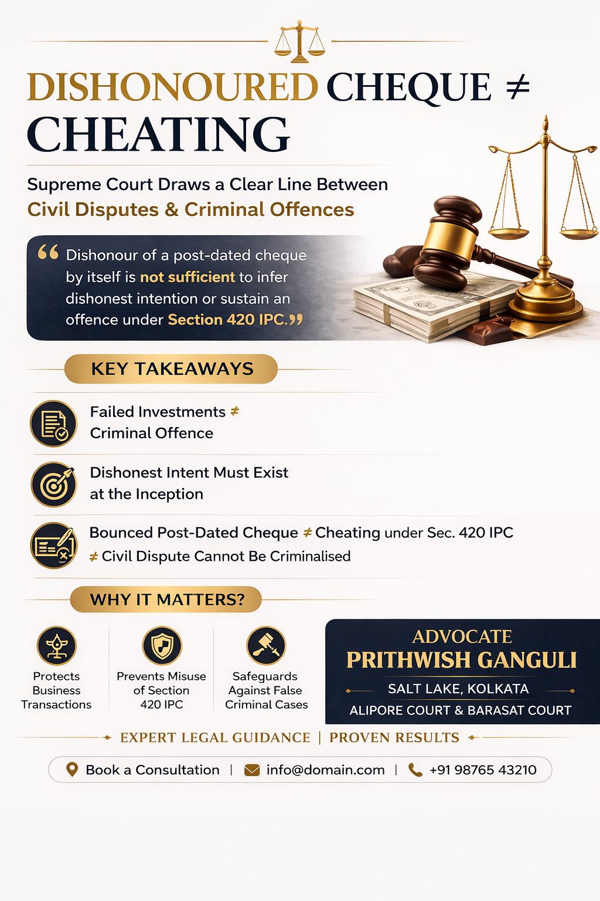

# Bounced Cheque ≠ Cheating: Supreme Court Draws a Clear Line Between Civil Disputes and Criminal Offence

## Table of contents

## Introduction: Can a Bounced Cheque Make You a Criminal?

In a significant ruling, the Supreme Court has once again reinforced a crucial legal principle: **Dishonour of a post-dated cheque, by itself, does not amount to cheating under Section 420 IPC.**

This judgment comes as a major relief in cases where failed business transactions are wrongly converted into criminal prosecutions, particularly in commercial and investment disputes.

## Background: When a Film Investment Turned Into a Criminal Case

The case arose from a film investment agreement, where the complainant invested money based on promised returns from a movie project.
- **Initial assurance:** 30% profit share
- **Additional funds invested later**
- **Project failed commercially**

To repay the amount, the accused issued two post-dated cheques of ₹24 lakh each, which were later dishonoured due to insufficient funds. This led to criminal proceedings under:
- **Section 406 IPC** (criminal breach of trust)
- **Section 420 IPC** (cheating)

While Section 406 was quashed, the High Court allowed prosecution under Section 420 IPC—leading to an appeal before the Supreme Court.

## Supreme Court’s Key Observation: Intention Matters at the Beginning

The Court emphasized a well-settled principle in criminal law:
👉 **Cheating requires dishonest intention at the very inception of the transaction**

It clarified:
- A mere failure of a business venture does not imply fraud
- A breach of promise or contract is not automatically cheating
- Criminal liability cannot arise from subsequent inability to repay

## Important Ruling on Post-Dated Cheques

The Court made a critical clarification: **Dishonour of a post-dated cheque alone cannot prove dishonest intention.**

Why? 
- Post-dated cheques are often issued as security or for future liability.
- Their dishonour may trigger action under the **Negotiable Instruments Act (Section 138)**, but it does **not** automatically establish cheating under Section 420 IPC.

## Commercial Risk ≠ Criminal Offence

In a practical observation, the Court noted that film production is inherently risky and no one can guarantee profit or success. This recognition is crucial because many disputes arise from business failures where losses are often mischaracterized as fraud.

## Civil Dispute vs Criminal Case: The Legal Divide

The judgment strongly reiterates:
- ✔ **Civil disputes** involve breach of contract or financial loss
- ❌ **Criminal cases** require fraudulent intent from the beginning

👉 Courts must prevent misuse of criminal law to pressure parties, recover money, or harass business counterparts.

## Final Decision of the Supreme Court

In **V. Ganesan vs State (2026)**, the Court:
- ✔ Allowed the appeal
- ✔ Quashed proceedings under Section 420 IPC
- ✔ Held that no dishonest intention existed at inception

The case was treated as a failed commercial transaction—not a criminal offence.

## Why This Judgment Matters for Clients

This ruling is extremely relevant for:
- Business investors and entrepreneurs
- Individuals facing cheque bounce allegations
- Parties involved in financial disputes

👉 It protects against the misuse of **Section 420 IPC** and the criminalization of civil disputes.

## Legal Insight: What You Should Do

If you are facing cheque bounce allegations or financial dispute litigation, it is crucial to assess:
- ✔ Nature of transaction
- ✔ Intention at inception
- ✔ Documentary evidence

Proper legal strategy can help quash criminal proceedings and defend against wrongful prosecution.

> **Final Takeaway:** Intent at the beginning—not outcome at the end—determines criminal liability. Understanding this distinction can protect you from serious legal consequences.

---

**Case Title:** V. Ganesan Vs. State Rep By The Sub Inspector of Police & Anr.
**Case No.:** Criminal Appeal No. 1470 of 2026

## Need Legal Assistance in Financial or Criminal Disputes?

If you are dealing with cheque bounce cases, Section 420 IPC allegations, or business disputes, expert legal guidance can make a decisive difference.

📍 **Advocate Prithwish Ganguli**  
**Chamber:** Salt Lake, Kolkata  
⚖️ **Practice:** Alipore Court & Barasat Court  
📞 **M.:** 99030 16246
