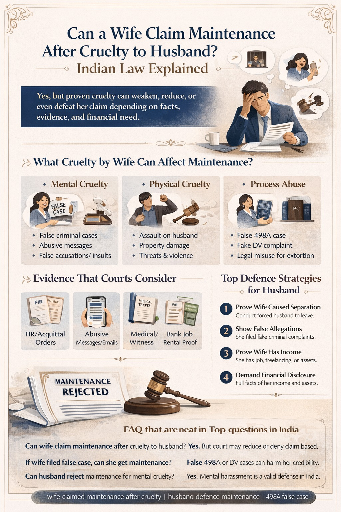

# Can a Wife Claim Maintenance After Cruelty to Husband? Indian Law Explained (2026)

## Table of contents

## Quick Answer

**Yes, a wife may still claim maintenance in India, but serious proven cruelty against the husband can weaken, reduce, or in some cases defeat the claim depending on the law, evidence, financial circumstances, and reasons for separation.** 

Courts examine fairness, conduct, need, and credibility before granting maintenance. If you are facing a maintenance case where the wife has been abusive or filed false criminal cases, understanding your legal defenses is essential.

## Is Maintenance an Automatic Right of the Wife?

**No.** Maintenance is meant to prevent destitution and ensure fairness. It is not an unconditional reward regardless of conduct. Indian courts often consider:
- Income of both parties
- Reasons for living separately
- Truthfulness of allegations
- Behaviour of spouses
- Financial need and ability of husband to pay

So if the wife committed serious cruelty, it can become an important defence for the husband.

## What Type of Cruelty by a Wife Can Affect Maintenance?

### 1. Mental Cruelty
This is one of the most common grounds in family litigation. Examples include:
- **False criminal accusations** and repeated threats of arrest.
- **Humiliation before relatives** and verbal abuse.
- **False allegations of affairs** or impotence.
- **Pressure to separate** the husband from his parents.
- **Abuse of Process**: Filing multiple retaliatory proceedings only to extort a settlement.

### 2. Physical Cruelty
Instances where the wife has assaulted the husband, caused property damage, or made threats with weapons are viewed seriously by courts.

## Can Maintenance Be Rejected for Cruelty by a Wife?

**Yes, in appropriate cases.** Depending on the statute invoked (such as Section 125 CrPC or Section 24 of the HMA) and the facts proved, courts may:
- Reject the maintenance claim entirely.
- Significantly reduce the maintenance amount.
- Deny interim maintenance.
- Question the credibility of the wife’s claim due to misconduct.

## Most Powerful Husband’s Defence Strategy

1. **Prove That the Wife Caused the Separation**: If the separation happened due to the wife’s cruelty, this is a highly relevant legal defense.
2. **Show False Allegations**: Prove that the wife filed false police or criminal cases (like 498A) where the husband later obtained a discharge or acquittal.
3. **Show Wife’s Independent Income**: Cruelty combined with earning capacity creates a much stronger defense than cruelty alone.
4. **Show Suppression of Facts**: If the wife hides her job, assets, or rental income from the court.

## Evidence That Can Win Such Cases

Courts rely on proof, not emotion. Useful evidence includes:
- **FIR closure reports** or acquittal orders.
- **Communications**: Emails, messages, or abusive WhatsApp chats.
- **Witness Statements**: Testimony from neighbors, friends, or family members.
- **Financial Records**: Proof of the wife's employment or business income.

## False 498A Case and Maintenance Claim

A highly searched issue is: *If the wife filed a false 498A, can she still get maintenance?* 

Possibly yes, but a false complaint can significantly damage her credibility in court. If the husband proves **malicious prosecution**, courts may consider that while deciding the maintenance amount and other matrimonial relief.

## Practical Steps to Build a Strong Defence

- **Step 1: Gather Proof**: Secure messages, prior complaints, and medical records.
- **Step 2: Financial Disclosure**: Provide an honest account of your salary, loans, and dependents.
- **Step 3: Show Wife’s Income**: Gather proof of her job, freelancing, or business assets.
- **Step 4: Consult an Expert**: Each law has different standards for proof and relief.

---

**Advocate Prithwish Ganguli**  
House # 73, near Tank #10, behind Matri Sadan Hospital,  
EE Block, Sector II, Bidhannagar, Kolkata, West Bengal 700091  
**M.:** 99030 16246

---

### Suggested SEO Tags
#DivorceLawyerKolkata #FamilyLawyerKolkata #MaintenanceLaw #HusbandDefence #CrueltyInMarriage #LegalUpdates2026 #AliporeCourt #BarasatCourt #MaintenanceCase #IndianLaw
