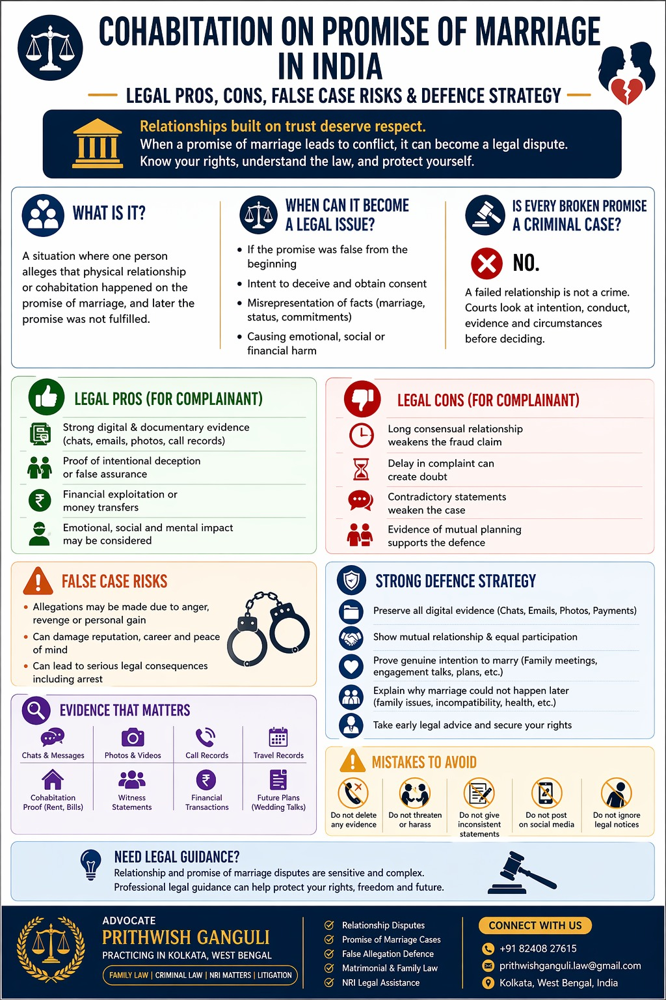

# Cohabitation on Promise of Marriage: A Complete Legal Guide (2026)

## Table of contents

## Introduction

In modern India, many couples enter relationships, live together, or cohabit with an intention to marry later. However, when the relationship breaks down, one of the most legally sensitive allegations that may arise is that physical relations or cohabitation took place on a **false promise of marriage**.

This often leads to criminal complaints, allegations of cheating, emotional abuse claims, or even serious charges depending on the facts. Courts across India have repeatedly examined whether the promise was genuine from the beginning or whether it was a fraudulent inducement.

If you are facing such allegations, or if you believe you were deceived, timely legal advice is essential. Many clients seek assistance for matters involving criminal defence, relationship disputes, live-in relationship litigation, and matrimonial conflicts in Kolkata.

## What Is Cohabitation on Promise of Marriage?

This phrase usually refers to a situation where:
- Two adults are in a romantic relationship.
- They live together or engage in consensual intimacy.
- One party allegedly promised marriage.
- Later, the marriage does not happen, leading to a legal dispute.

The legal question often becomes: **Was the promise genuine but later became impossible, or was it false from the start?** This distinction is extremely important for the outcome of the case.

## Indian Law on Promise of Marriage Cases

Indian courts generally distinguish between:

### 1. Genuine Relationship That Failed Later
If parties were in a consensual adult relationship and the marriage could not happen due to family opposition, incompatibility, distance, or later breakdown, courts may treat the matter as a failed relationship rather than a crime.

### 2. Fraudulent Promise Made Only to Obtain Consent
If evidence shows that one party never intended to marry from the beginning and used false assurances only to secure consent or cohabitation, criminal liability may arise.

## Is Every Broken Promise a Criminal Case?

**No.** A failed relationship is not automatically a criminal offence. Courts often examine:
- Duration of the relationship.
- Messages, emails, and call records.
- Engagement steps taken or avoided (e.g., family introductions).
- Postponement tactics or concealment of an existing marriage.

## Best Defence Strategy in Promise of Marriage Cases

If you are facing false or exaggerated allegations, early defence is critical. 

1. **Preserve All Digital Evidence**: Keep all WhatsApp chats, emails, photos, and social media messages. These are often the strongest proof of a mutual relationship.
2. **Show Mutual Relationship**: Evidence of equal participation and consent is relevant.
3. **Prove Genuine Intention to Marry**: Wedding shopping, venue discussions, or family meetings can prove that the intention was genuine at the time.
4. **Explain Why the Marriage Failed**: Family resistance, discovery of incompatibility, or relocation issues are valid reasons for a relationship to end.

## Important Evidence Courts Consider

- **Digital Evidence**: Voice notes, photos, and email promises.
- **Conduct Evidence**: Public acknowledgment of the relationship, rent agreements, and neighbor testimony.
- **Financial Evidence**: Transfers made for marriage preparations or gifts under inducement.

## Landmark Judgment: Rajnish Singh @ Soni v State of U.P. (2025)

The Supreme Court of India in **Rajnish Singh @ Soni v State of U.P. (2025 INSC 308)** recently reiterated the principles governing these cases, emphasizing the need to distinguish between a breach of promise and a false promise made with the intent to deceive.

---

**Advocate Prithwish Ganguli**  
House # 73, near Tank #10, behind Matri Sadan Hospital,  
EE Block, Sector II, Bidhannagar, Kolkata, West Bengal 700091  
**M.:** 99030 16246

---

### Suggested SEO Tags
#DivorceLawyerKolkata #FamilyLawyerKolkata #RelationshipLaw #PromiseOfMarriage #LegalUpdates2026 #KolkataLawyer #CriminalDefense #LiveInRelationships #IndianLaw #SupremeCourt
