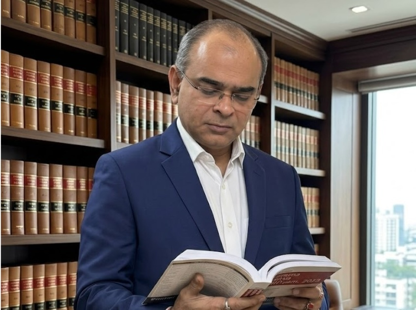

# Looking for the Best Divorce Lawyer in Kolkata? Complete Guide to Family, Custody & Alimony Cases

## Table of contents

## Introduction: Why Hiring a Divorce Lawyer in Kolkata is Crucial

Divorce is one of the most sensitive and life-changing decisions a person can make. Whether it is a mutual separation or a contested dispute, having the right **divorce lawyer in Kolkata** can make a significant difference in how smoothly the process unfolds.

If you are searching online for a **lawyer near me Kolkata**, or trying to find a reliable **family lawyer in Kolkata**, this detailed guide will help you understand everything—from legal procedures to choosing the right advocate for your case.

## Expertise of an Experienced Family Lawyer in Kolkata

A divorce case involves multiple legal complexities such as alimony, child custody, property disputes, and legal documentation. An experienced **divorce lawyer in Kolkata** ensures that your case is handled professionally and your rights are fully protected.

A skilled **family lawyer in Kolkata** not only represents you in court but also helps you understand your legal rights, prepare documentation, and handle negotiations.

## Mutual Divorce vs Contested Divorce – Mutual Divorce Lawyer Kolkata

### Mutual Divorce
If both spouses agree to end the marriage amicably, hiring a **mutual divorce lawyer Kolkata** is the best option. Benefits include faster resolution, lower costs, and less stress.

## Contested Divorce and Domestic Disputes
When disputes arise, you need a strong **divorce lawyer in Kolkata** or **family lawyer in Kolkata** to represent your interests in court, especially in cases of financial disagreements or custody battles.

## Alimony & Maintenance – Alimony Case Lawyer Kolkata

Financial matters are often the most disputed aspect of divorce. A knowledgeable **alimony case lawyer Kolkata** helps ensure fair financial settlement. They will assess income/liabilities and calculate fair maintenance.

## Child Custody Cases – Child Custody Lawyer Kolkata

Child custody cases require careful legal handling. A professional **child custody lawyer Kolkata** focuses on the welfare of the child while protecting parental rights. They assist in filing petitions, negotiating visitation, and representation in court.

## Finding the Best Lawyer Near Me Kolkata

Many clients start their search with “**lawyer near me Kolkata**”, but choosing the right advocate requires more than just proximity. Depending on your location, you may consider an **advocate near Salt Lake Kolkata** or a **lawyer in Bidhannagar Kolkata**.

## Advocate near Salt Lake Kolkata and Lawyer in Bidhannagar Kolkata

Having an **advocate near Salt Lake Kolkata** for easy accessibility or a **lawyer in Bidhannagar Kolkata** with local court experience can significantly impact the outcome of your case.

## Jurisdiction Specifics – Barasat Court Lawyer & Barrackpore Court Lawyer

Different courts handle cases based on jurisdiction. It is highly beneficial to consult a **Barasat court lawyer** or a **Barrackpore court lawyer** depending on where your case is filed.

## How to Choose the Best Family Lawyer in Kolkata

When selecting a **family lawyer in Kolkata**, keep experience, track record, and accessibility in mind. Whether you need a specialist **mutual divorce lawyer Kolkata** or a **child custody lawyer Kolkata**, have clinical expertise.

## Why the Right Lawyer in Bidhannagar Kolkata Makes or Breaks a Case

A qualified **lawyer in Bidhannagar Kolkata** does more than just file cases. They protect your rights, ensure fair settlement, and guide you emotionally through the process.

## Final Words: Securing Your Future with the Right Legal Support

Whether you are looking for a **lawyer near me Kolkata**, an **advocate near Salt Lake Kolkata**, or a **Barasat court lawyer**, the right legal guidance will help you move forward with confidence.

---

**Advocate Prithwish Ganguli**  
House # 73, near Tank #10, behind Matri Sadan Hospital,  
EE Block, Sector II, Bidhannagar, Kolkata, West Bengal 700091  
**M.:** 99030 16246
