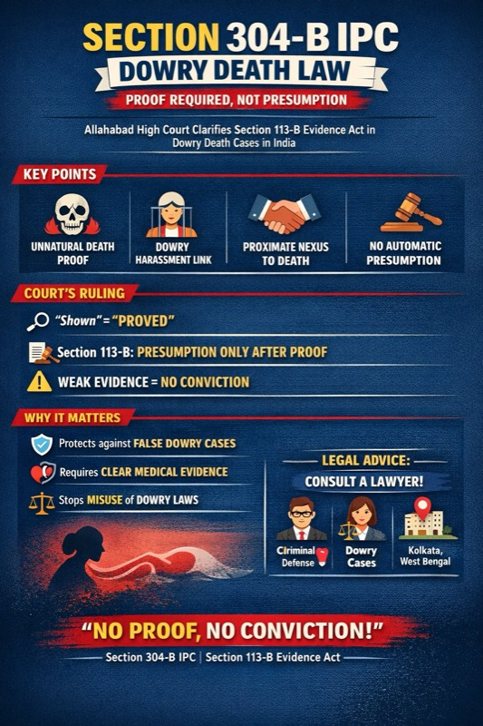

# Section 304-B IPC Dowry Death Explained: Allahabad High Court Clarifies Proof Required Under Section 113-B Evidence Act

## Table of contents

## Introduction: Proof Over Presumption

In a significant ruling shaping dowry death law in India, the Allahabad High Court has held that the word **“shown”** in Section 304-B IPC dowry death must be interpreted as **“proved.”** 

This clarification directly impacts how courts apply the **Section 113-B Evidence Act** presumption in dowry death cases in India, reinforcing that proof in dowry death cases is essential before any presumption can arise. This is a key development in criminal law for cases involving Section 498-A IPC cruelty and allegations of dowry harassment.

## The Case: Mewa Lal & Ors. v. State of Uttar Pradesh

The case involved allegations of dowry death under Section 304-B IPC, along with Section 498-A IPC cruelty and offences under the Dowry Prohibition Act, 1961. 

The trial court had convicted the accused primarily because the death occurred within seven years of marriage. However, the Allahabad High Court clarified that **death within seven years of marriage alone is not sufficient** to invoke the Section 113-B Evidence Act presumption unless supported by strong and credible evidence.

## The Requirement of Unnatural Death

The Court emphasized that in Section 304-B IPC cases, the prosecution must first establish that the death occurred under unnatural or suspicious circumstances. 
- **Medical Evidence:** In this case, post-mortem and viscera reports did not indicate poisoning, injury, or any abnormal cause of death.
- **Critical Component:** Without establishing unnatural death, the foundation of a dowry death prosecution in India becomes weak.

## Establishing the Nexus with Dowry Demands

The Court clarified that Section 498-A IPC cruelty must be supported by specific, credible, and consistent evidence. 
- **Beyond Vague Allegations:** Vague allegations of demands for money are common, but they must be clearly linked to harassment connected to a dowry demand.
- **Proximate Nexus:** There must be a proximate nexus between the cruelty and the death. Without this nexus, neither Section 304-B IPC dowry death nor Section 498-A IPC cruelty can be sustained.

## Safeguards Against Wrongful Conviction

The Court addressed the misuse of statutory presumptions, observing that courts sometimes apply the Section 113-B Evidence Act presumption mechanically. 

> **“Legal presumption in dowry death cases arises only after proof of foundational facts, including unnatural death, dowry-related cruelty, and proximity between cruelty and death.”**

This interpretation strengthens safeguards against wrongful conviction in false dowry death cases and ensures that laws are applied fairly.

## Final Decision and Acquittal

On examining the evidence, the Court found:
1. No specific instances of cruelty under Section 498-A IPC.
2. No reliable proof of dowry demand directly connected to the death.
3. Absence of medical evidence establishing unnatural death.

As a result, the Court held that the essential ingredients of dowry death under Section 304-B IPC were not proved. The conviction was set aside, and the accused were acquitted.

## Why This Judgment Matters

This ruling is highly relevant for individuals dealing with:
- Dowry death allegations (Section 304-B IPC)
- Section 498-A IPC cruelty cases
- General dowry harassment cases in India

It emphasizes that courts will require strict compliance with evidentiary standards. For those facing such allegations, consulting an experienced criminal lawyer or divorce lawyer in Kolkata can be crucial in challenging weak prosecution evidence.

👉 **Final Takeaway:**  
In dowry death law in India, the principle is now firmly established—  
*“Section 304-B IPC requires proof, Section 113-B Evidence Act allows presumption only after proof, and no conviction can stand without evidence.”*

---

**Cause Title:** Mewa Lal & Ors. v. State of Uttar Pradesh  
**Neutral Citation:** 2026:AHC-LKO:22648

---

**Advocate Prithwish Ganguli**  
House # 73, near Tank #10, behind Matri Sadan Hospital,  
EE Block, Sector II, Bidhannagar, Kolkata, West Bengal 700091  
**M.:** 99030 16246
