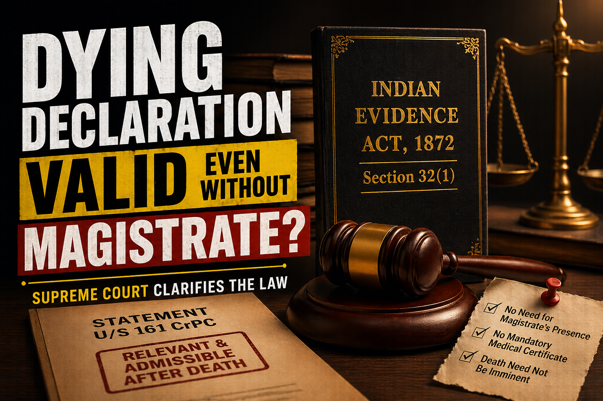

# Dying Declaration Valid Even Without Magistrate? Supreme Court Clarifies the Law

## Table of contents

## Introduction: Substance Over Technicality

In a significant ruling, the Supreme Court of India has once again clarified the law relating to **dying declarations** and their evidentiary value in criminal trials. The judgment reinforces an important principle: justice should not fail merely because procedural formalities were absent when a victim made a statement about the crime.

For anyone dealing with serious criminal litigation, understanding this principle is essential. Whether you are an accused person or a victim’s family member, the law on dying declarations can often play a decisive role in trial outcomes.

## What is a Dying Declaration?

A dying declaration is a statement made by a person regarding the cause of their death or the circumstances leading to it. Under **Section 32(1) of the Indian Evidence Act**, such statements are admissible in court because the maker of the statement is no longer available to testify. The rationale is simple: a person facing death is presumed unlikely to lie about the circumstances of the crime.

## Supreme Court’s Important Clarification

In the recent judgment of *Neeraj Kumar v. State of UP*, the Court clarified three major points:

### 1. Magistrate’s Presence is Not Mandatory
While recording a dying declaration before a Magistrate is preferable, it is **not an absolute legal requirement**. If the statement is voluntary, reliable, and connected with the cause of death, it may still be accepted by the court even if recorded by a police officer or a doctor.

### 2. Medical Fitness Certificate is Not Essential
Courts prefer medical certification showing the victim was mentally fit to speak. However, its absence does not automatically invalidate the declaration. If witnesses show the person was conscious and coherent, the statement may still be relied upon.

### 3. Death Need Not Be Immediate
Even if the injured person survives for weeks or months before succumbing to injuries, the statement can still qualify as a dying declaration if it concerns the fatal incident.

## Why This Judgment Matters

This ruling prevents genuine evidence from being discarded due to technical objections. In many real-life emergencies, waiting for a Magistrate is simply not possible. The Supreme Court has emphasized that **substance must prevail over rigid technicalities** where truth and justice are involved.

## Impact on Criminal Trials

Dying declarations can be powerful evidence in cases involving:
- Murder and Attempt to Murder.
- Dowry Death and Domestic Violence.
- Assault cases where the victim later passes away.

## Expert Legal Representation

Because dying declarations often become central evidence, a proper legal strategy is essential. Defense may challenge voluntariness or mental condition, while the prosecution relies on corroborative evidence. Consulting an experienced **criminal lawyer in Kolkata** can make a substantial difference in such high-stakes matters.

---

**Cause Title: Neeraj Kumar v. State of UP (Decided on 4 December 2025)**  
**Citations: 2025 INSC 1386 | 2025 SCO.LR 12(2)[9]**

---

**Advocate Prithwish Ganguli**  
House # 73, near Tank #10, behind Matri Sadan Hospital,  
EE Block, Sector II, Bidhannagar, Kolkata, West Bengal 700091  
**M.:** 99030 16246
