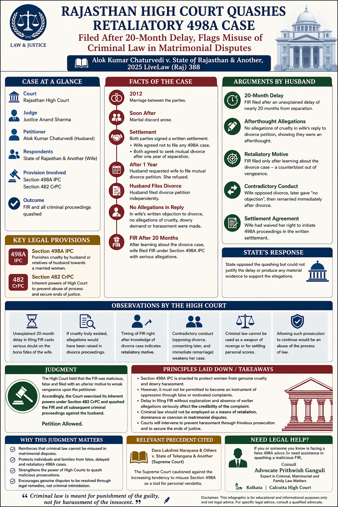

# False 498A Case Filed After Divorce? Rajasthan High Court Gives Major Relief

## Table of contents

## Introduction: A Major Shield Against Misuse

In a major judgment that will help thousands facing false 498A cases in India, the **Rajasthan High Court** has quashed a criminal case filed by a wife nearly 20 months after leaving the matrimonial home. The court held that criminal law cannot be misused as a tool of revenge in matrimonial disputes.

The case, *Alok Kumar Chaturvedi v. State of Rajasthan & Another (2025)*, serves as a crucial precedent for anyone dealing with:
- False 498A cases in Kolkata or elsewhere.
- Quashing of 498A FIRs in the High Court.
- Anticipatory bail for matrimonial criminal charges.

## Why This Judgment Is So Important

Many matrimonial disputes now involve criminal complaints filed strategically after a divorce notice, maintenance dispute, or custody fight. Courts are increasingly scrutinizing the misuse of criminal law as a "counterblast" to civil proceedings. This judgment sends a clear message: **Criminal law is for justice, not revenge.**

## Facts of the Case: Timing is Everything

The marriage took place in 2012. Following marital discord, the couple executed a written settlement where the wife agreed not to initiate Section 498A proceedings. However, when the husband filed for divorce later, the wife suddenly filed a criminal FIR under Section 498A.

### The Husband’s Defence:
- **20-Month Delay**: Why wait nearly two years if the cruelty was genuine?
- **No Earlier Complaint**: In her written response to the divorce case, she made no mention of cruelty or dowry demands.
- **Counterblast to Divorce**: The FIR was filed only after the husband sought legal separation.

## Rajasthan High Court’s Findings

Justice Anand Sharma found that the complaint lacked *bona fides*. The court observed:
- **Unexplained Delay**: A 20-month delay without explanation creates serious doubt about the truthfulness of the allegations.
- **Silence in Earlier Pleadings**: If cruelty truly existed, it would likely have appeared in the wife's reply to the divorce petition.
- **Timing of the FIR**: Filing a criminal case immediately after receiving a divorce notice suggests a retaliatory motive.

## Final Result: Quashing of Harassment

The Rajasthan High Court quashed the FIR and all subsequent criminal proceedings, providing significant relief to the husband and his family.

## Wife Filed False 498A After Divorce Notice? What To Do Immediately

1. **Do Not Panic**: False allegations can be challenged effectively with a proper legal strategy.
2. **Preserve Evidence**: Collect all chats, emails, prior notices, and settlement agreements.
3. **Apply for Anticipatory Bail**: If there is a risk of arrest, securing bail is the first priority.
4. **Prepare a Quashing Petition**: Approach the High Court under Section 482 CrPC (or relevant BNSS provisions) to quash the FIR if it is clearly malicious.

## Expert Guidance in Kolkata

If you are facing a false 498A case in Kolkata or the Calcutta High Court, immediate strategy is crucial. Whether it involves an NRI husband, false family implication, or maintenance pressure tactics, professional legal assistance can help you secure justice.

---

**Cause Title: Alok Kumar Chaturvedi v. State of Rajasthan & Another, 2025 LiveLaw (Raj) 388**

---

**Advocate Prithwish Ganguli**  
House # 73, near Tank #10, behind Matri Sadan Hospital,  
EE Block, Sector II, Bidhannagar, Kolkata, West Bengal 700091  
**M.:** 99030 16246
