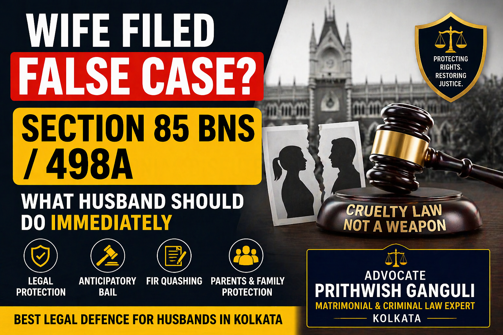

# Wife Filed False Section 85 BNS / 498A Case? Read This Immediately

## Table of contents

## Introduction: A Shield Against False Allegations

If your wife has filed a false **Section 85 Bharatiya Nyaya Sanhita (BNS)** case or an allegation under the earlier **Section 498A IPC**, your first reaction may be fear, confusion, or panic. This is normal, but panic is dangerous. A false matrimonial cruelty complaint can affect your freedom, your job, and your family's reputation.

The good news is that a strong legal defence can protect you. If you are searching for a **false 498A lawyer in Kolkata** or need guidance on **Section 85 BNS**, this guide explains the immediate steps you must take.

## Quick Answer: What Should a Husband Do Immediately?

1.  **Stay Calm**: Do not panic or react emotionally.
2.  **Contact a Lawyer**: Seek experienced legal counsel in Kolkata immediately.
3.  **Anticipatory Bail**: Apply for protection from arrest for yourself and your family if required.
4.  **Preserve Evidence**: Secure all WhatsApp chats, emails, bank records, and call logs.
5.  **Protect Family**: Ensure parents and relatives are legally shielded from vague implications.
6.  **Avoid Confrontation**: Do not threaten or message the complainant in anger.

## What is Section 85 BNS?

With the recent criminal law reforms in India, the earlier offence of matrimonial cruelty under **Section 498A IPC** is now addressed under **Section 85 of the Bharatiya Nyaya Sanhita (BNS)**. While genuine cruelty deserves protection, courts increasingly recognize that these laws are sometimes misused as tools for leverage in divorce or maintenance disputes.

## Common Reasons for False Complaints

Many inflated or false complaints arise after:
- The husband files for divorce.
- A maintenance or alimony dispute begins.
- A child custody battle intensifies.
- There is a disagreement over property or a one-time settlement amount.

## Immediate Legal Protection in Kolkata

### 1. Anticipatory Bail
If there is an apprehension of arrest, securing **anticipatory bail** is the most critical first step. This protects the husband and named family members from being taken into custody while the case is investigated.

### 2. Protecting Parents and Senior Citizens
Casual implication of elderly parents or distant relatives is a common tactic. Courts often provide relief to relatives where no specific allegations exist or where they reside separately from the couple.

### 3. Preserving Digital Evidence
Evidence lost today may never return. Collect and secure all electronic communication that contradicts the allegations of cruelty.

## Can a False FIR Be Quashed?

**Yes, in suitable cases.** You can approach the High Court to quash a malicious or vague FIR if:
- The allegations are impossible or factually contradictory.
- There is an unexplained, long delay in filing the complaint.
- The complaint is clearly a retaliatory "counterblast" to a divorce notice.

## Why Choose Advocate Prithwish Ganguli?

Strategic representation in matrimonial criminal litigation is essential. Whether you are dealing with a **false 498A case in Kolkata**, need help with **anticipatory bail**, or are an **NRI husband** facing cross-border legal challenges, professional guidance can make all the difference.

---

**Advocate Prithwish Ganguli**  
House # 73, near Tank #10, behind Matri Sadan Hospital,  
EE Block, Sector II, Bidhannagar, Kolkata, West Bengal 700091  
**M.:** 99030 16246
