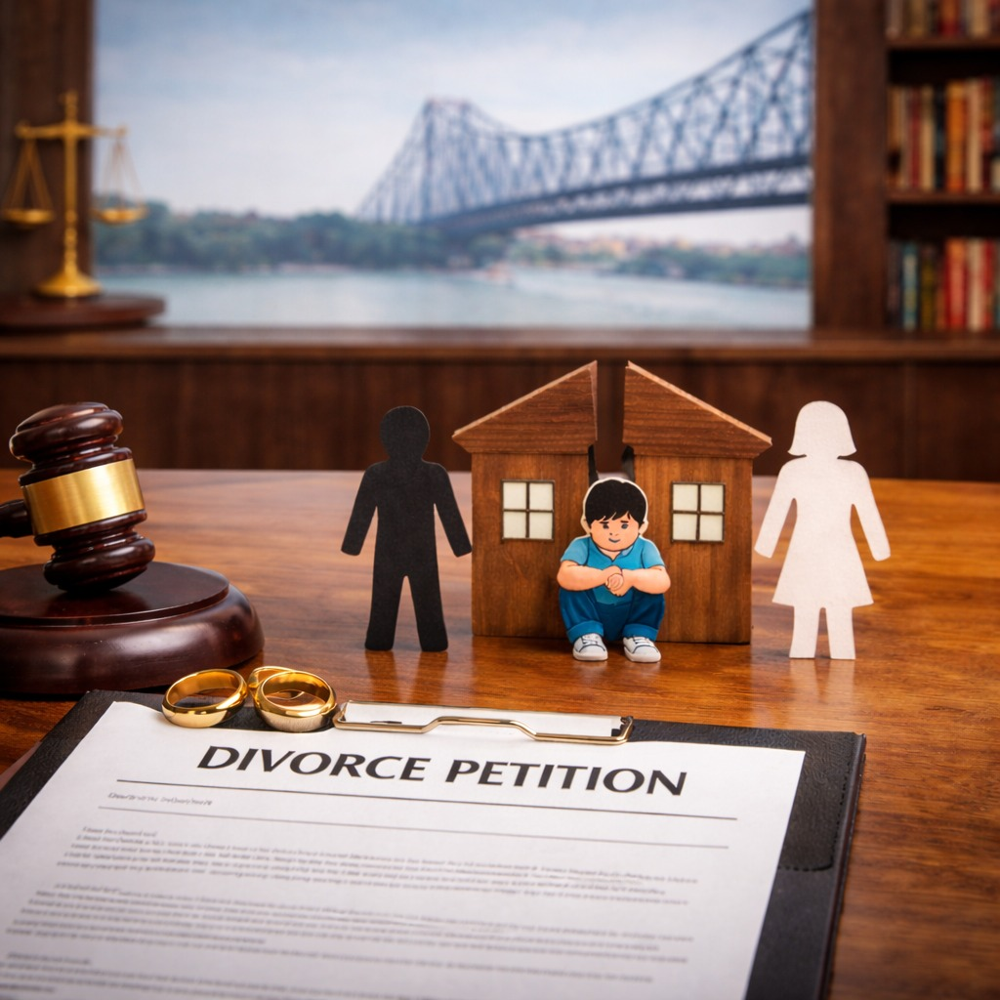

# My Husband/Wife Filed Divorce – What Should I Do? (Legal Guide for Kolkata)

## Table of contents

## Introduction: ACT Quickly and Informed

Finding out that your husband or wife has filed for divorce can be overwhelming, stressful, and confusing. Whether the decision was expected or came as a shock, knowing the right legal steps can protect your rights and help you move forward with clarity.

If you are searching for a **divorce lawyer in Kolkata** or a reliable **family lawyer in Kolkata**, this guide will help you understand exactly what to do next.

## ⚖️ Step 1: Don’t Panic – Understand the Type of Divorce Filed

The first thing you should do is carefully read the legal notice or petition you have received. There are generally two types of divorce cases:

- **✔️ Mutual Divorce:** If both partners agree, the case can be handled by a mutual divorce lawyer Kolkata, making the process faster and less stressful.
- **⚠️ Contested Divorce:** If your spouse has filed without your consent, it is a contested divorce. In such cases, you must immediately consult an experienced divorce lawyer in Kolkata to respond properly.

## 📄 Step 2: Read the Petition Carefully

The divorce petition will contain:
- Grounds for divorce (cruelty, desertion, etc.)
- Claims for alimony or maintenance
- Child custody requests

Before reacting emotionally, consult a **family lawyer in Kolkata** to understand the legal implications. A professional lawyer will help you prepare a strong reply.

## 🧑‍⚖️ Step 3: Hire an Experienced Divorce Lawyer in Kolkata

This is the most important step. Choosing a lawyer with experience in specific domains is crucial:
- **Divorce cases**
- **Alimony disputes**
- **Child custody matters**

An experienced family lawyer in Kolkata like **Advocate Prithwish Ganguli** can guide you through court procedures and protect your interests. If you are located nearby, you may also require:
- An advocate near Salt Lake Kolkata
- A lawyer in Bidhannagar Kolkata
- A Barasat court lawyer or Barrackpore court lawyer

## 💬 Step 4: Decide Your Approach – Fight or Settle

After consulting your divorce lawyer, you need to decide your legal strategy:
- **✔️ Contest the Divorce:** If you do not agree with the allegations, your lawyer will file a written statement and defend your case in court.
- **✔️ Go for Mutual Settlement:** If both parties are open to discussion, your lawyer may suggest converting the case into mutual divorce.

## 💰 Step 5: Understand Alimony and Financial Rights

If your spouse has claimed or denied maintenance, you must consult an **alimony case lawyer Kolkata** immediately. They will evaluate your financial position, ensure fair maintenance, or defend against excessive claims.

## 👶 Step 6: Handle Child Custody Carefully

If children are involved, custody becomes a crucial issue. A skilled **child custody lawyer Kolkata** will help you file for custody or visitation rights, ensuring the child’s welfare is prioritized.

## 🏛️ Step 7: Attend Court Hearings and Follow Legal Advice

Once the case begins, you must:
- Attend all hearings
- Submit required documents
- Follow your lawyer’s advice strictly

Whether your case is in Kolkata, Salt Lake, or Barasat, having proper representation ensures smooth handling of proceedings.

## ⚠️ Common Mistakes to Avoid

Avoid these critical errors after receiving a divorce notice:
- ❌ Ignoring the legal notice
- ❌ Responding emotionally without legal advice
- ❌ Delaying hiring a divorce lawyer in Kolkata
- ❌ Posting sensitive information on social media

## 🧠 Why Legal Guidance is Essential

Divorce cases involve legal, financial, and emotional complexities. A professional divorce lawyer ensures proper representation and protection of your rights. Choosing the right legal expert can significantly impact your case.

🏆 **Final Thoughts:** If your husband or wife has filed for divorce, remember that you still have legal rights and options. The key is to act quickly, stay informed, and seek professional legal help.

---

**Advocate Prithwish Ganguli**  
House # 73, near Tank #10, behind Matri Sadan Hospital,  
EE Block, Sector II, Bidhannagar, Kolkata, West Bengal 700091  
**M.:** 99030 16246
