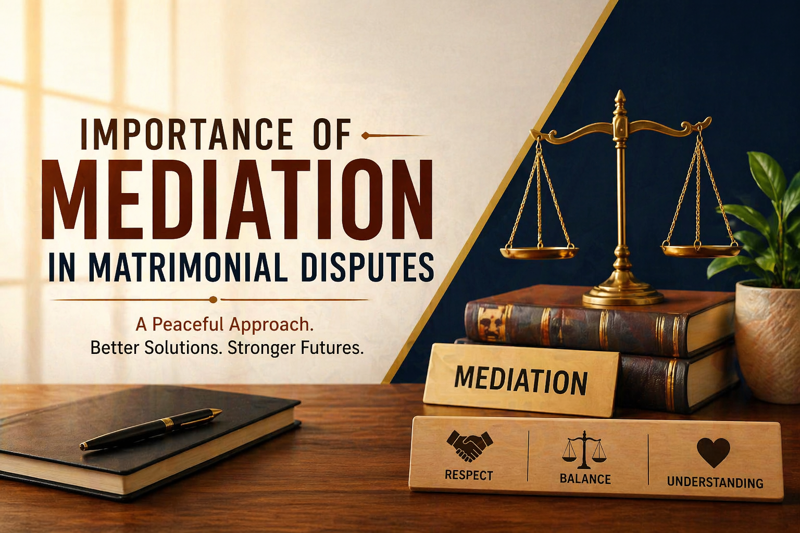

# The Importance of Mediation in Matrimonial Disputes: A Path to Peace

## Table of contents

## Introduction

Matrimonial disputes are among the most emotionally challenging legal matters a person can face. Issues involving divorce, maintenance, child custody, alimony, and family conflict often affect not only the husband and wife but also children, parents, and extended family members. 

In such sensitive situations, **mediation** has emerged as one of the most effective and humane methods of dispute resolution. Instead of immediately engaging in a prolonged court battle, mediation offers both parties an opportunity to communicate, negotiate, and settle issues with the help of a neutral third party known as a mediator.

## What is Mediation?

Mediation is a voluntary and confidential process where a neutral mediator assists the parties in reaching a mutually acceptable settlement. The mediator does not impose a decision but helps both sides understand each other’s concerns and explore practical solutions.

In matrimonial disputes, mediation may deal with:
- **Divorce settlement terms** and mutual consent discussions.
- **Child custody** and visitation rights.
- **Maintenance and alimony** arrangements.
- **Return of belongings** or *streedhan*.
- **Future parenting plans** and communication issues.

## Why Mediation is Important in Matrimonial Cases

### 1. Reduces Emotional Stress
Court litigation in family matters often becomes adversarial. Mediation creates a calmer environment where parties can speak openly and respectfully, reducing hostility and helping individuals feel heard.

### 2. Faster Resolution
Traditional litigation can take months or years. Mediation can often resolve issues in a much shorter time, often in just a few sessions when both parties are willing to cooperate.

### 3. Cost-Effective
Long legal battles become expensive due to repeated appearances and procedural steps. Mediation often saves substantial legal costs and personal expenses.

### 4. Protects Privacy
Matrimonial disputes involve deeply personal matters. Mediation is generally confidential, allowing parties to discuss sensitive issues with greater comfort and dignity than in a public courtroom.

### 5. Better for Children
When children are involved, hostile litigation can negatively affect their emotional well-being. Mediation allows parents to focus on the **best interests of the child** rather than “winning” a case, creating practical plans for schooling, holidays, and shared responsibilities.

### 6. Preserves Relationships
Even if reconciliation is not possible, parties may still need to communicate in the future, especially where children are involved. Mediation helps preserve workable relationships and reduces long-term bitterness.

## When Mediation is Most Useful

Mediation is particularly useful in cases involving:
- Mutual divorce discussions.
- Maintenance and alimony settlements.
- High-stakes child custody disputes.
- NRI matrimonial disputes.
- Post-separation parenting conflicts.

## The Role of a Lawyer During Mediation

Legal advice remains crucial during mediation. A lawyer helps ensure that the settlement is **fair, lawful, practical, and enforceable**. A good matrimonial lawyer can guide clients on their legal rights, reasonable expectations, and the drafting of binding terms that protect long-term interests.

---

**Advocate Prithwish Ganguli**  
House # 73, near Tank #10, behind Matri Sadan Hospital,  
EE Block, Sector II, Bidhannagar, Kolkata, West Bengal 700091  
**M.:** 99030 16246
