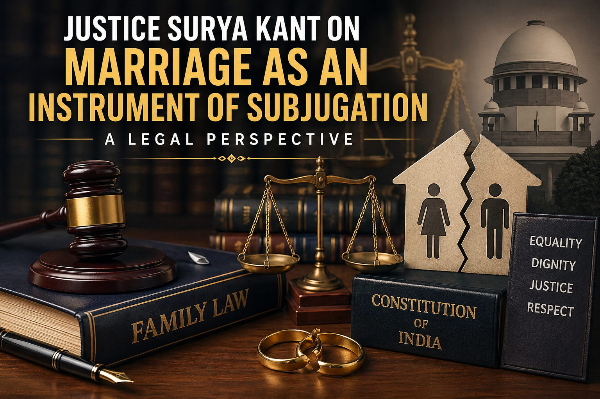

# Justice Surya Kant on Marriage as an Instrument of Subjugation: A Legal Perspective

## Table of contents

## Introduction: A Shift in Matrimonial Jurisprudence

In a landmark address in October 2025, Supreme Court Judge **Justice Surya Kant** sparked a national conversation on the evolution of matrimonial jurisprudence. Speaking at a seminar titled *"Cross-Cultural Perspectives: Emerging Trends and Challenges in Family Law in England and India,"* he observed that historically, marriage has been frequently misused as an instrument of subjugation against women. 

As an advocate committed to gender justice and constitutional values, **Prithwish Ganguli** examines the legal shift from viewing marriage as a "sacred sacrament" to a partnership grounded in equality and dignity.

## The Transformation of Matrimonial Law

Justice Surya Kant noted that in pre-colonial times, family relations were governed more by social and moral norms than by codified laws, often leading to a "site of inequality" for women. Contemporary reforms are gradually transforming the institution into a "pious partnership." 

Key highlights from the address include:

- **Gender Equality & Dignity**: Referencing Articles 14 and 21, Justice Kant emphasized that judicial passivity in the face of atrocities like dowry-related violence emboldens perpetrators and erodes the foundations of a civilized society.
- **Welfare of the Child**: In cross-border matrimonial disputes, the welfare of the child must be the paramount consideration. 
- **Decriminalizing Adultery**: Championing sexual autonomy within marriage and breaking patriarchal glass ceilings.
- **Recognition of Foreign Decrees**: Indian courts will not recognize foreign divorce judgments if they were obtained by fraud or contravened principles of natural justice.
- **Maintenance & Social Justice**: Recent rulings such as *Rina v. Dinesh (2025)* reinforce that maintenance is a measure of social justice intended to prevent destitution and protect a wife’s dignity.

## Family Courts as "Family Resolution Centres"

Justice Surya Kant suggested a more humane justice system, proposing that Family Courts be renamed **"Family Resolution Centres"**. He urged legal professionals to "shun black robes" in these courts to reduce fear in children and foster a more compassionate environment.

## Expert Legal Counsel

For legal counsel on matrimonial disputes, domestic violence cases, or child custody matters, **Advocate Prithwish Ganguli** provides expertise in navigating these evolving legal landscapes, ensuring that justice is not just a procedural outcome but a reflection of dignity and mutual respect.

---

**Advocate Prithwish Ganguli**  
House # 73, near Tank #10, behind Matri Sadan Hospital,  
EE Block, Sector II, Bidhannagar, Kolkata, West Bengal 700091  
**M.:** 99030 16246
