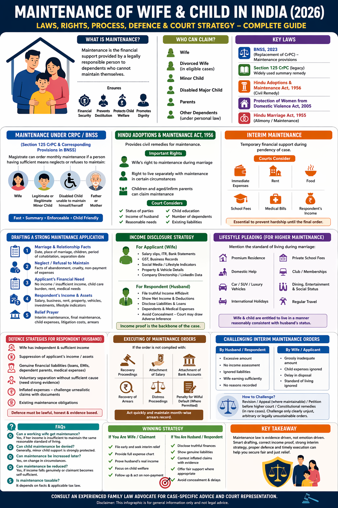

# Maintenance Law in India: Interim, Final, and Child Support Strategy (2026)

## Table of contents

## Introduction

In today’s legal world, especially with the introduction of new criminal laws, matrimonial litigation has become more complex. One of the most critical aspects of any matrimonial dispute—whether it's divorce, domestic violence, or judicial separation—is **Maintenance**. 

Maintenance is not just about financial support; it’s about ensuring that a spouse and children can maintain a reasonable standard of living after separation. In India, maintenance laws are meant to prevent destitution and ensure that no person is forced to live in hardship due to the breakdown of a marriage.

## Who Can Claim Maintenance?

In India, several laws allow different individuals to seek support. Most commonly:
- **Wife**: Whether she is working or not, she can claim support if her income is insufficient.
- **Children**: Both minor and sometimes major children (if dependent) are entitled to support.
- **Aged/Infirm Parents**: Parents can also claim support from their children.

Courts consider several factors, including the status of the parties, the income of the respondent, reasonable needs, child education expenses, and existing liabilities.

## Interim Maintenance: Immediate Financial Protection

### What is Interim Maintenance?
Interim maintenance is temporary monthly support granted while a case is still pending. Since final maintenance cases can take years, interim relief is critical for survival.

### What Courts Consider for Interim Relief
- **Immediate Expenses**: Rent, food, and basic bills.
- **Child Education**: School fees and extracurricular costs.
- **Medical Bills**: Ongoing healthcare requirements.
- **Standard of Living**: The lifestyle the couple enjoyed during the marriage.

## How to Draft a Strong Maintenance Application

A weak petition loses leverage early. A strong petition creates pressure and credibility.

### Essential Structure:
1. **Marriage and Relationship Facts**: Clear details on the marriage date, children, and separation.
2. **Neglect or Refusal to Maintain**: Explicit facts showing that support was demanded but refused.
3. **Applicant’s Financial Need**: A detailed breakdown of why support is needed (e.g., no job, child care burden).
4. **Respondent’s Income Details**: Mention all known sources (Salary, Business, Rental income, Investments).
5. **Relief Prayer**: Specifically ask for interim support, final maintenance, and litigation expenses.

## Income Disclosure Strategy (The Most Important Part)

Income disputes decide the maintenance amount. If a party hides income, courts may draw an adverse inference.

### How to Prove the Spouse’s Income:
- **Salary Slips** and Company website profiles.
- **LinkedIn** employment data and social media lifestyle posts.
- **GST records** and Income Tax Returns.
- **Bank statements** and Vehicle/Property ownership records.

## Lifestyle Pleading Strategy

Instead of just saying a spouse is "rich," you must plead specific lifestyle facts:
- "Lived in a premium apartment with domestic help."
- "Owned luxury SUVs."
- "Frequent international holidays and club memberships."
- "Children attend top-tier private schools."

Lifestyle evidence helps courts estimate real earning capacity where formal income might be hidden.

## Defence Strategies Against Maintenance Claims

If you are defending against a maintenance claim, your strategy must be fact-based and documented:
1. **Wife Has Independent Income**: Show that the claimant earns enough to support themselves.
2. **Suppression of Applicant’s Income**: Prove hidden bank accounts or business receipts.
3. **Genuine Financial Liabilities**: Show debt obligations, medical burdens, or other dependents.
4. **Inflated Expense Claims**: Challenge exaggerated budgets through cross-examination and proof.

## Child Maintenance: A Priority for Courts

Child support is treated with the utmost seriousness. It includes food, clothing, education, medical care, and reasonable lifestyle support. Even if the court disputes the wife’s maintenance, the child’s maintenance is often granted independently.

## Conclusion: Proof Beats Outrage

Maintenance law in India is evidence-driven, not emotion-driven. Success depends on smart drafting, income proof, lifestyle evidence, and strong execution tactics. A well-prepared case often wins faster and on better terms.

---

**Advocate Prithwish Ganguli**  
House # 73, near Tank #10, behind Matri Sadan Hospital,  
EE Block, Sector II, Bidhannagar, Kolkata, West Bengal 700091  
**M.:** 99030 16246

---

### Suggested SEO Tags
#DivorceLawyerKolkata #FamilyLawyerKolkata #MaintenanceLaw #InterimMaintenance #ChildSupport #LegalUpdates2026 #KolkataLawyer #AliporeCourt #BarasatCourt #IndianLaw
