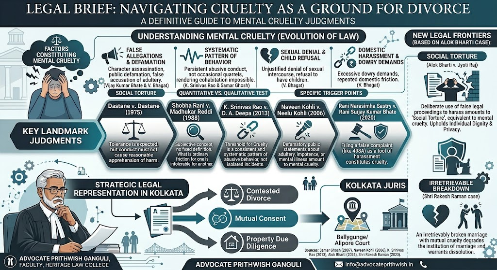

# Mental Cruelty as a Ground for Divorce: Evolution of Judicial Trends in India

## Table of contents

## Introduction

In contemporary Indian jurisprudence, the sanctity of marriage no longer demands the endurance of suffering. As the Supreme Court has evolved, **"Cruelty"** has shifted from a physical act to a psychological state. For litigants in Kolkata, understanding these precedents is the first step toward reclaiming their right to a life of dignity.

## 1. The Foundation: Tolerance and the "Ordinary Wear and Tear"

### *Dastane v. Dastane (AIR 1975 SC 1534)*
This case remains the "North Star" for divorce law. The Court established that marriage is built on mutual adjustment. However, it drew a line: when the conduct of one spouse creates a reasonable apprehension in the mind of the other that it is unsafe or injurious to continue the relationship, the legal threshold of cruelty is met.
- **Key takeaway:** Litigation must distinguish between "petty quarrels" and "substantial cruelty."

## 2. The Subjectivity of Pain

### *Shobha Rani v. Madhukar Reddi (1988) 1 SCC 105*
The Court ruled that cruelty is not a "straitjacket" concept. It varies based on social status, education, and cultural environment. What constitutes an intolerable environment for a professional in Ballygunge or a faculty member in Kolkata might be viewed differently in another context.
- **Key takeaway:** The court assesses the impact on the victim, not just the intent of the perpetrator.

## 3. Specific Categories of Mental Agony

### *V. Bhagat v. D. Bhagat (1994) 1 SCC 337*
This judgment is critical for identifying non-physical abuse. The Court explicitly recognized:
- **Unfounded accusations of infidelity:** A grave assault on a spouse’s character.
- **Sexual Denial:** Unjustified refusal of physical intimacy is a form of cruelty.
- **Dowry Pressures:** Persistent demands that create emotional distress.

## 4. Character Assassination as "Social Torture"

### *Vijay Kumar Ramchandra Bhate v. Neela Vijay Kumar Bhate (2003) 6 SCC 334*
The Court highlighted that making "disgusting and unsubstantiated allegations" about a spouse's chastity in a written statement or during cross-examination is a permanent assault on honor. Once these allegations are made in court, the damage is considered irreparable.

### *Alok Bharti v. Jyoti Raj (Patna High Court)*
This recent perspective adds the layer of **Privacy**. The Court held that forcing a spouse into false legal battles or making illicit claims about their private life constitutes "social torture," which is as damaging as any physical blow.

## 5. The Quantitative vs. Qualitative Test

### *Samar Ghosh v. Jaya Ghosh (2007) 4 SCC 511*
This is perhaps the most cited case in Alipore and Sealdah Courts. The Court listed various instances of mental cruelty, such as a spouse undergoing a unilateral vasectomy/abortion or a total coldness in behavior.
- **The Rule:** It must be a consistent pattern of behaviour, not a "one-off" incident of anger.

## 6. The Weaponization of the Law

### *Rani Narasimha Sastry v. Rani Suneela Rani (2020) 18 SCC 247*
In a significant protection for the accused, the Court noted that while filing a case is a legal right, filing a false case (such as under Section 498A) that leads to an acquittal can be treated as mental cruelty against the husband.

## 7. Irretrievable Breakdown and Mutual Hostility

### *Shri Rakesh Raman v. Smt. Kavita (2023)*
The Court observed that when a marriage has become so acrimonious that both parties are effectively "at war," the institution of marriage is already dead. Continuing such a union is, in itself, an act of cruelty.

## Strategic Legal Representation in Kolkata

For those seeking a **Divorce in Kolkata**, the choice of counsel is pivotal. A lawyer must not only understand the law but also the specific sensitivities of the Calcutta High Court and District Courts.

Advocate **Prithwish Ganguli**, with his unique blend of academic insight as a Faculty Member at Heritage Law College and practical experience in Salt Lake (Bidhannagar), offers a sophisticated approach to:
- **Mutual Consent Divorce:** Ensuring fair alimony and asset division.
- **Contested Petitions:** Proving mental cruelty through rigorous evidence.
- **Property Due Diligence:** Safeguarding your financial future post-separation.

---

**Advocate Prithwish Ganguli**  
House # 73, near Tank #10, behind Matri Sadan Hospital,  
EE Block, Sector II, Bidhannagar, Kolkata, West Bengal 700091  
**M.:** 99030 16246
