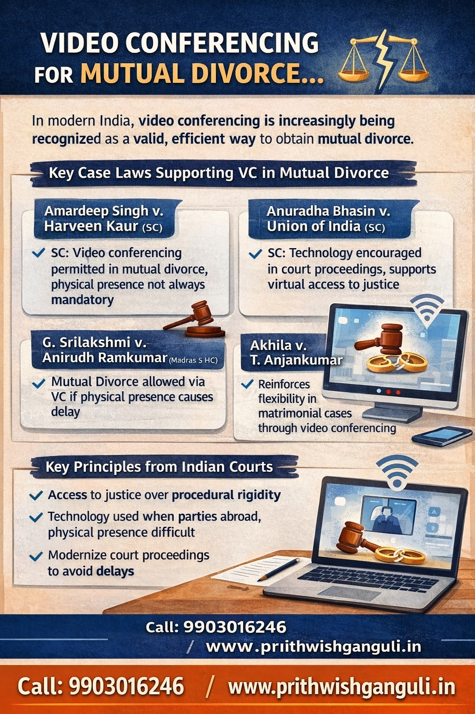

# Can You Get Mutual Divorce Without Going to Court?

## Table of contents

## Introduction: The Rise of Virtual Justice

**Yes.** Indian courts now allow mutual divorce through video conference in appropriate cases, making the process faster and more convenient—especially for NRI couples or parties living in different cities.

If you are searching for a **divorce lawyer in Kolkata** or a **family lawyer in Salt Lake Kolkata**, understanding this legal option can save you time, cost, and unnecessary travel.

## ⚖️ Key Supreme Court Judgment: Amardeep Singh v. Harveen Kaur

The Supreme Court clarified that:
- Physical presence is not mandatory in every case.
- Courts can allow video conferencing in mutual divorce cases.
- The six-month cooling-off period can be waived under specific conditions.

👉 This judgment forms the backbone of mutual divorce through video conference in India.

## ⚖️ Other Important Judgments

Several other High Court rulings have supported this transition toward digital accessibility:

- **Anuradha Bhasin v. Union of India**: Emphasized technology-driven access to justice.
- **G. Shrilakshmi v. Anirudh Ramkumar**: Allowed divorce proceedings via video conferencing due to practical difficulty.
- **G. Yogeetha v. V.S. Sharvendiran**: Recognized flexibility in matrimonial procedure.
- **Akhila v. T. Anjankumar**: Supported virtual participation in family law matters.

## 📌 Why Courts Allow Video Conference Divorce

- **✔️ Avoid unnecessary delay**: Speeds up the legal resolution.
- **✔️ Reduce travel burden**: No need to fly across countries or states.
- **✔️ Help NRI litigants**: Simplifies the process for those residing abroad.
- **✔️ Ensure access to justice**: Makes the legal process more democratic and accessible.

## 🧾 Procedure for Mutual Divorce via Video Conference

1. **File joint petition**: Start the legal process with your spouse.
2. **Apply for VC permission**: File a specific application explaining why you cannot appear physically.
3. **First motion**: Conduct the first hearing via video conference.
4. **Cooling-off period**: Can be waived depending on the case.
5. **Second motion**: Conduct the final hearing via VC.
6. **Final decree**: Receive your divorce decree digitally or via post.

## ⚡ Benefits of Online Mutual Divorce

- No repeated court visits.
- Faster case disposal.
- Lower legal expenses.
- Ideal for long-distance couples.

## ❗ Important Note

Video conferencing is **not automatic**. Proper legal drafting and specific court permission are required to prove the necessity of virtual appearance.

👉 Always consult an experienced **family lawyer in Kolkata** or **divorce lawyer in Salt Lake Kolkata** to ensure your application is successful.

## 🏆 Conclusion

With evolving judicial trends, mutual divorce through video conference is now a practical and legally supported option in India. Courts are prioritizing efficiency and accessibility over rigid procedures.

---

**Advocate Prithwish Ganguli**  
House # 73, near Tank #10, behind Matri Sadan Hospital,  
EE Block, Sector II, Bidhannagar, Kolkata, West Bengal 700091  
**M.:** 99030 16246  
**W:** [www.prithwishganguli.in](https://www.prithwishganguli.in)

---

### Schema Markup for Performance

