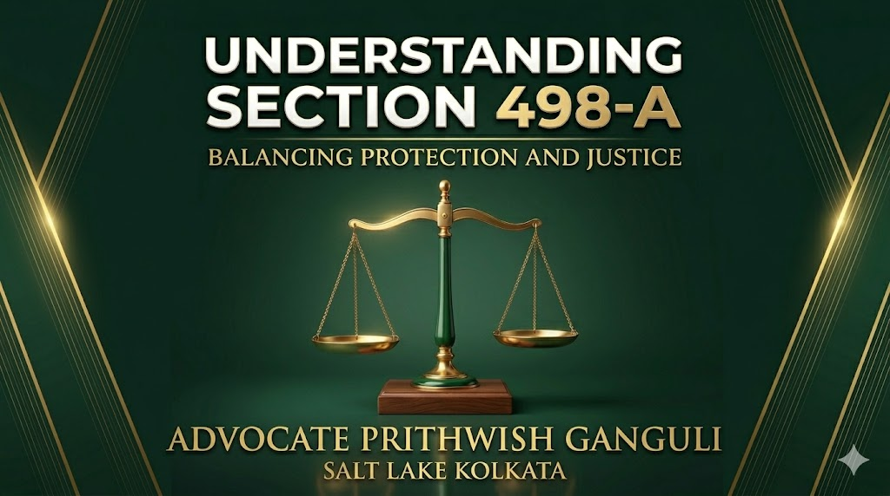

# Section 498-A IPC Explained by the Supreme Court: Protection Against Cruelty or Scope for Misuse?

## Table of contents

## Introduction

Marriage is built on trust, dignity, and mutual respect. But when cruelty, harassment, or dowry-related abuse enters a household, the law must step in. That is why **Section 498-A IPC** was introduced—to protect married women from cruelty by the husband or his relatives.

At the same time, courts have recognized that in some cases, this provision may be misused through vague or exaggerated allegations. The Supreme Court of India has repeatedly worked to maintain a fair balance: protecting genuine victims while preventing the abuse of the criminal process.

## What is Section 498-A IPC?

Section 498-A of the Indian Penal Code (and corresponding provisions under current criminal law reforms) punishes cruelty by the husband or his relatives. Cruelty generally includes:

1.  **Conduct likely to drive a woman to suicide or cause grave injury**: This includes physical violence, repeated humiliation, or severe emotional abuse.
2.  **Harassment for unlawful demands**: Specifically dowry demands, pressure for gold, property, or continuous financial extortion.

## Supreme Court on the Misuse of Section 498-A

Over the years, the Supreme Court has noted a troubling trend where entire families—including married sisters living elsewhere and elderly grandparents—are named in FIRs without specific allegations. The Court has clarified that **mere naming of relatives is not enough**; there must be clear allegations showing active involvement.

## Landmark Supreme Court Judgments

- **Dara Lakshmi Narayana v. State of Telangana (2024)**: The Court quashed proceedings against relatives where no specific roles were assigned, cautioning against the casual inclusion of all family members.
- **Kahkashan Kausar v. State of Bihar (2022)**: Observed that forcing extended relatives to undergo criminal trials without concrete proof causes deep injustice.
- **Arnesh Kumar v. State of Bihar (2014)**: Directed police not to make automatic or mechanical arrests immediately upon the filing of a 498-A FIR.
- **Meera v. State (2022)**: Clarified that cruelty by a mother-in-law or female relatives is equally punishable.

## How Courts Distinguish Genuine Cases

Courts closely examine:
- Specific dates, times, and incidents.
- Independent witness statements and medical evidence.
- Digital proofs (SMS, emails, call logs).
- Documented financial transactions or prior reconciliation attempts.

## Strategic Legal Handling in Kolkata

In regions like Salt Lake, New Town, and broader Kolkata, matrimonial disputes often involve a complex web of parallel proceedings (Divorce, DV, Maintenance, 498-A, and Custody). Managing these effectively requires a coordinated, evidence-backed strategy.

Whether you are a wife seeking protection from abuse or a husband falsely accused as a pressure tactic, early legal intervention is key.

---

**Advocate Prithwish Ganguli**  
House # 73, near Tank #10, behind Matri Sadan Hospital,  
EE Block, Sector II, Bidhannagar, Kolkata, West Bengal 700091  
**M.:** 99030 16246
