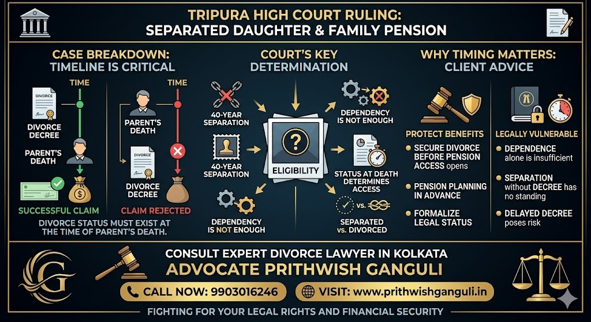

# How Can an NRI Solve a Property Dispute in Kolkata Without Coming to India?

## Table of contents

## Introduction

If you are an NRI dealing with a property dispute in Kolkata, you are not alone. Thousands of Non-Resident Indians face serious issues involving ancestral homes, flats, inherited property, tenants, forged documents, or relatives trying to take control while they are abroad.

The good news is this: **you can solve most property disputes in Kolkata without travelling to India**, if the matter is handled quickly and strategically.

Today, with Power of Attorney, digital documentation, video consultations, and experienced legal representation, NRIs in the USA, UK, UAE, Canada, Australia, and other countries can protect their property rights from abroad.

## Why NRIs Commonly Face Property Disputes in Kolkata

Kolkata has a large number of old family properties, inherited houses, co-owned flats, and ancestral assets. Many disputes arise because the owner is living overseas. Common NRI property disputes include:

- **Illegal Possession**: A relative, tenant, caretaker, or third party refuses to vacate.
- **Family Property Disputes**: Brothers, sisters, or co-heirs dispute ownership shares.
- **Forged Sale Deeds or POA Misuse**: Someone tries to sell or transfer the property fraudulently.
- **Tenant Problems**: Rent not paid, refusal to vacate, unauthorized subletting.
- **Partition and Inheritance Issues**: No clear division after the death of parents.

If not handled early, these disputes become more expensive and legally complex.

## Can an NRI Handle a Kolkata Property Case Without Visiting India?

**Yes, in many cases absolutely.** NRIs often do not need to travel immediately. A properly planned legal strategy can allow most work to begin remotely.

This may include:
- Lawyer consultation by video call.
- Sending scanned documents online.
- Issuing legal notices.
- Filing cases through authorized representation.
- Record searches and title verification.
- Court appearances by advocate.
- Settlement discussions.

Personal presence may be needed in some cases later, but many matters progress substantially without travel.

## Step-by-Step: How NRIs Can Resolve Property Disputes in Kolkata

### 1. Collect All Property Documents
Start gathering Sale deeds, mutation records, property tax receipts, death certificates, and any prior family settlements. Strong documentation wins cases.

### 2. Appoint a Reliable Property Lawyer in Kolkata
The biggest mistake NRIs make is depending only on relatives. Instead, appoint an experienced local lawyer. **Advocate Prithwish Ganguli** assists NRIs in property disputes, title litigation, possession matters, and family property conflicts in Kolkata.

### 3. Send a Strong Legal Notice
Many disputes are resolved at this stage. A formal legal notice can pressure illegal occupants, co-owners, or defaulting tenants to comply before litigation starts.

### 4. File the Correct Legal Case
Depending on the dispute, the remedy may be an Injunction suit, Title suit, Partition suit, or Eviction proceedings. Choosing the correct case type is crucial.

### 5. Use Power of Attorney for Remote Management
NRIs can authorize trusted representation to sign documents and assist proceedings legally, saving repeated travel costs.

## What If Relatives Have Occupied My House in Kolkata?

This is one of the most searched NRI issues. Do not delay because “they are family.” Many illegal occupation cases worsen over time. Immediate legal notice and injunction action may be necessary.

## Why Choose Advocate Prithwish Ganguli?

If you need legal help for an NRI property dispute in Kolkata, Advocate Prithwish Ganguli provides practical legal support for overseas clients, including title verification, illegal possession action, and remote case handling.

---

**Advocate Prithwish Ganguli**  
House # 73, near Tank #10, behind Matri Sadan Hospital,  
EE Block, Sector II, Bidhannagar, Kolkata, West Bengal 700091  
**M.:** 99030 16246
