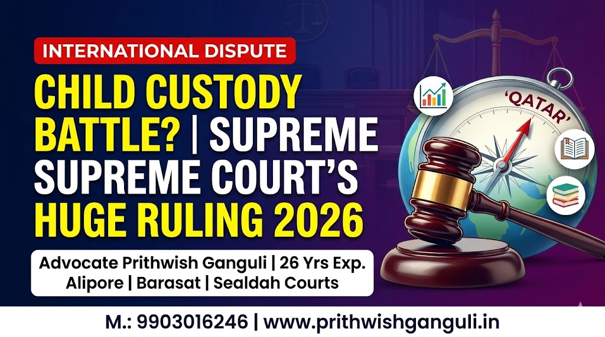

# Beyond 'Child Welfare': The Supreme Court’s Multi-Dimensional Approach to Custody

## Table of contents

## Introduction: A Sophisticated Interpretation of Welfare

Consulting a **family lawyer in Kolkata** is essential when navigating the complexities of international custody battles. In a landmark 2026 ruling (*Mohtashem Billah Malik v. Sana Aftab*), the Supreme Court of India provided a sophisticated interpretation of the "welfare of the child" principle, emphasizing that financial capacity, education, and lifestyle are not mere secondary thoughts—they are integral to a child's future.

As a seasoned **divorce lawyer in Kolkata**, I have seen many cases where emotional bonds are prioritized over practical stability. This judgment corrects that imbalance.

## The Case: Qatar to Srinagar

The dispute involved two Indian citizens: an electrical engineer based in Qatar and his well-educated wife. Following a divorce in the Qatar Family Court, the wife moved the children to India, allegedly without the husband’s consent. 

When the matter reached the Supreme Court, the central question was whether the High Court was right to focus only on a narrow definition of "welfare" while ignoring the father’s superior financial ability to provide a global education and a higher standard of living in Qatar.

## The 4 Pillars of Custody: More Than Just Emotion

The Supreme Court clarified that while the child's welfare is the "paramount consideration," the following factors must be weighed cumulatively:

- **Financial Capacity:** A parent’s ability to provide for the child’s material needs.
- **Standard of Living:** The quality of life, including healthcare and infrastructure.
- **Educational Opportunities:** The long-term academic prospects available in the respective locations.
- **The Child’s Comfort & Preference:** In this case, the children expressed a clear desire to explore life in Qatar with their father.

## Why "Material Aspects" Matter

The Court noted that the children spoke only English and struggled to integrate with local children in India. This linguistic and cultural barrier made the father’s environment in Qatar more suitable for their specific educational needs. 

For anyone seeking a **child custody lawyer in Kolkata**, this is a vital lesson: your ability to provide a stable, familiar, and high-quality environment is a powerful legal argument.

## Key Takeaways for Litigants in West Bengal

If you are involved in a custody battle at the Alipore, Barasat, or Sealdah Courts, keep these points in mind:

1. **Foreign Decrees Matter:** The Supreme Court criticized the High Court for ignoring the Qatar Court’s judgment. International legal standing carries weight in Indian courts.
2. **Conduct of Parents:** The wife’s violation of a court undertaking (contempt) was viewed seriously. Your behavior during litigation directly impacts your "fitness" as a guardian.
3. **The Child's Voice:** Even if memories of a place are limited, the court will listen to a child’s inclination and comfort levels with each parent.

## Expert Guidance for Complex Custody

International custody and high-stakes matrimonial disputes require a blend of empathy and technical precision. With 26 years of experience, I help parents build cases that satisfy the court’s rigorous "welfare" and "capacity" standards.

---

**Cause Title: Mohtashem Billah Malik v. Sana Aftab (2026 SCC OnLine SC 146, decided on 4-2-2026)**

---

**Advocate Prithwish Ganguli**
- **Phone:** +91 9903016246
- **Google Profile:** [View Profile](https://share.google/LmJyxZ3GKZMSCClOG)
- **Chamber:** EE Block, Sector II, Bidhannagar, Kolkata 700091
- **Courts Served:** Alipore, Barasat, Barrackpore, Sealdah, Baruipur, Serampore.

#DivorceLawyerKolkata #FamilyLawyerKolkata #ChildCustody #SupremeCourt #LegalUpdates2026 #AliporeCourt #BarasatCourt #SealdahCourt #ChildCustodyLawyer #WestBengal #KolkataLegalServices
