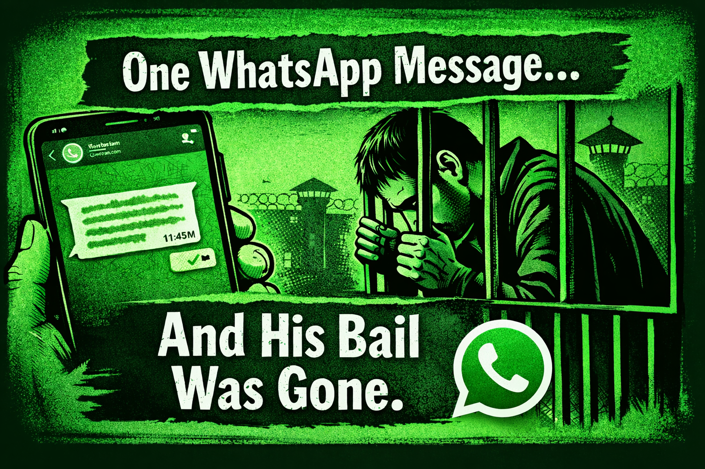

# WhatsApp Chats as Evidence in India: What Courts Really Accept (Section 65B Explained)

## Table of contents

## ⚖️ Introduction: Your WhatsApp Messages Are Not as Safe as You Think

One message. One screenshot. One assumption. That’s all it takes to either strengthen your case—or completely destroy it.

In today’s digital world, platforms like WhatsApp, Instagram, and Telegram have become primary modes of communication. While WhatsApp offers end-to-end encryption, giving users a sense of privacy and security, the real question is: **Will your WhatsApp chats stand in court?**

For any experienced **lawyer in Kolkata**, especially a **divorce lawyer in Kolkata** or **family lawyer in Kolkata**, this is no longer a theoretical question—it’s a daily reality in litigation.

## 📱 The Legal Reality: Are WhatsApp Chats Admissible in Court?

The Delhi High Court, in *Dell International India Private Limited v. Adeel Feroze (2024)*, addressed a critical issue: whether WhatsApp chats can be accepted as valid evidence.

🧾 **Court’s Clear Position:**
- WhatsApp messages are not automatically admissible.
- They require mandatory certification under **Section 65B of the Indian Evidence Act, 1872**.
- Without this certification, even genuine chats can be rejected outright.

⚖️ **Brief Overview of the Case**
The dispute arose when a respondent claimed incomplete receipt of documents via WhatsApp screenshots. The High Court held that WhatsApp chats cannot be relied upon without a Section 65B certificate, especially when they were not part of earlier proceedings.

## 📜 What is Section 65B Certificate? (Explained Simply)

To make WhatsApp chats admissible, you must provide a certificate confirming:
- ✔️ Details of the electronic record.
- ✔️ How it was produced and the device used.
- ✔️ Authenticity (proving it was not tampered with).
- ✔️ Regular use of the device in the ordinary course of business/life.

👉 This ensures the reliability of digital evidence in the eyes of the law.

## 🏛️ Important Judgments Supporting Admissibility

1. **Arjun Panditrao Khotkar v. Kailash Kushanrao Gorantayal (2020)**: The Supreme Court clarified that a certificate is mandatory unless the original device is produced in court.
2. **Rakesh Kumar Singla v. Union of India (2021)**: The Punjab & Haryana High Court held that Section 65B certification is mandatory even at the stage of bail.
3. **M/S Karuna Abhushan Pvt. Ltd. v. Achal Kedia (2020)**: The Court recognised WhatsApp chats as valid evidence and blue ticks as proof of reading, subject to Section 65B.

## 🚨 Why This Matters (Especially in Matrimonial Cases)

In cases handled by a **divorce lawyer in Kolkata**, WhatsApp chats are often used in:
- Divorce disputes
- Domestic violence cases
- Maintenance proceedings
- Harassment allegations

👉 A single message can prove cruelty or establish intent, but without proper certification, it becomes useless.

## 💣 Biggest Mistake People Make

Many people assume that screenshots are enough or that deleting messages will help them. In reality, courts need rigorous legal proof. **No certificate = No evidence.**

## 🧠 Practical Advice from a Lawyer in Kolkata

If you are dealing with any legal dispute:
- 👉 Do **NOT** rely on screenshots alone.
- 👉 Ensure proper **Section 65B certification** is obtained.
- 👉 Preserve the original devices and do not factory reset them.

Consulting a **divorce lawyer in Kolkata** early can prevent these serious procedural mistakes.

## 🏁 Conclusion: Digital Evidence Needs Legal Validation

The law is evolving with technology—but not blindly. WhatsApp chats are powerful evidence, but only when legally validated. As courts become stricter, individuals must understand that digital communication is not just casual—it is legally consequential.

---

**Advocate Prithwish Ganguli**  
House # 73, near Tank #10, behind Matri Sadan Hospital,  
EE Block, Sector II, Bidhannagar, Kolkata, West Bengal 700091  
**M.:** 99030 16246  
**Google Profile:** [View Profile](https://share.google/GjaHgTHCv49Jepgi5)

---

### Schema Markup for Performance

