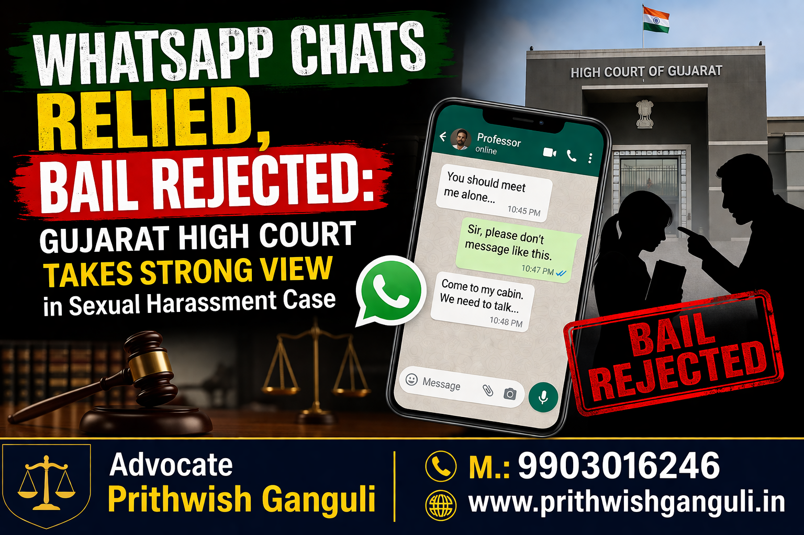

# WhatsApp Chats Relied, Bail Rejected: Gujarat High Court’s Strong Stand on Digital Evidence

## Table of contents

## Introduction

In a crucial ruling, the **Gujarat High Court** has denied bail to a college professor accused of seeking sexual favours from a student, relying heavily on WhatsApp chats as primary evidence. This judgment reflects the growing importance of digital evidence in criminal proceedings.

For any **lawyer in Kolkata**, especially a **divorce lawyer in Kolkata** or a **family lawyer in Kolkata**, this case highlights how electronic communication is now central to litigation strategy.

## ⚖️ Key Observations by the Court

The Court found that:
- WhatsApp chats clearly indicated inappropriate demands.
- The accused had pressured the victim for a relationship.
- An apology letter further supported the allegations.
- The trial had already commenced and the complainant was examined.

The Court concluded that there was sufficient prima facie evidence, making it inappropriate to grant bail.

## 🚨 Abuse of Authority: A Serious Concern

The Court treated the case seriously due to:
- The accused being a college professor.
- The victim being his student.

This power imbalance played a key role in denying bail. A **family lawyer in Kolkata** would recognise similar concerns in matrimonial disputes where dominance and coercion influence legal outcomes.

## 📱 Role of WhatsApp Chats in Bail Decisions

The judgment reinforces that:
- Digital evidence like chats can establish intent and conduct.
- Courts are increasingly relying on electronic records.
- Even at the bail stage, such evidence can be decisive.

For a **divorce lawyer in Kolkata**, this is particularly relevant in domestic violence cases, matrimonial disputes, and harassment allegations.

## 🧾 Impact of Apology Letter

The accused had written an apology admitting:
- Inappropriate conduct.
- Improper communication with students.

The Court treated this as corroborative evidence, strengthening the prosecution’s case.

## ❌ Why Bail Was Rejected

The Court denied bail because:
- Serious nature of allegations.
- Strong documentary and digital evidence.
- Ongoing trial proceedings.
- Risk of influencing the case.

This reflects a stricter judicial approach where evidence outweighs procedural leniency.

## 🧠 Legal Takeaway for Practitioners

For any **lawyer in Kolkata**, the key lessons are:
- Digital evidence is now central to legal strategy.
- Clients must be advised about WhatsApp and online conduct.
- Courts are prioritizing substance over technicalities.

A **family lawyer in Kolkata** or **divorce lawyer in Kolkata** must now treat electronic records as primary evidence, not supplementary.

## 🏆 Conclusion

This judgment reinforces a clear legal trend:
👉 **Courts will not hesitate to deny bail where WhatsApp chats clearly demonstrate misconduct.**

As legal disputes increasingly involve digital communication, the role of a skilled lawyer in Kolkata becomes critical in interpreting and presenting such evidence effectively.

---

**Cause Title: Manishkumar Shivlal Chauhan v. State of Gujarat (Neutral Citation: 2026:GUJHC:23449)**

---

**Advocate Prithwish Ganguli**  
House # 73, near Tank #10, behind Matri Sadan Hospital,  
EE Block, Sector II, Bidhannagar, Kolkata, West Bengal 700091  
**M.:** 99030 16246  
**W:** [www.prithwishganguli.in](https://www.prithwishganguli.in)

---

