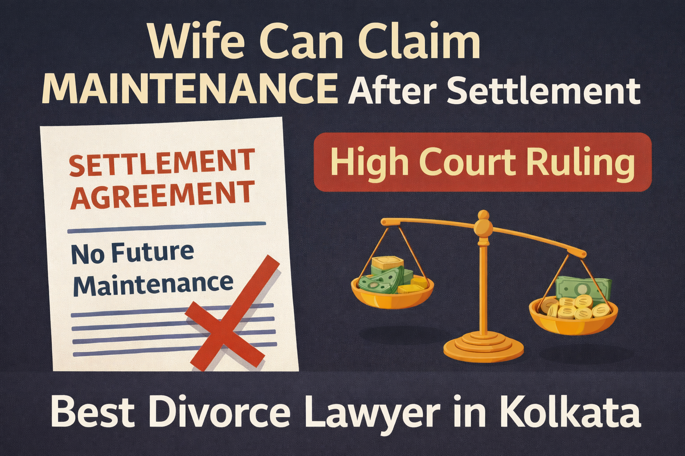

# Wife Can Claim Maintenance Despite Earlier Settlement if She Cannot Maintain Herself: Important High Court Ruling

## Table of contents

## Introduction: A Shield Against Destitution

In a significant judgment that may affect thousands of divorced women across India, the **Kerala High Court** has held that a wife can still claim maintenance from her former husband even after signing a prior compromise agreement, if she later becomes unable to maintain herself.

This ruling reinforces a powerful legal principle: **maintenance rights are based on social justice and public policy**, and cannot always be permanently waived through private settlements.

For individuals facing divorce, alimony, or post-divorce financial disputes, this decision carries serious importance. According to **Advocate Prithwish Ganguli**, such judgments show that courts prioritize fairness over technical clauses in agreements.

## What Did the Court Decide?

The Court held that:
- A wife who earlier accepted a lump sum settlement is **not automatically barred** from claiming maintenance later.
- If her financial circumstances change and she cannot support herself, she may seek maintenance.
- Courts can reconsider earlier maintenance arrangements when circumstances change.
- Maintenance law exists to prevent destitution and hardship.

This means that simply writing “no future maintenance claim” in a divorce settlement may not always end the matter legally.

## Why This Judgment Matters in Real Life

Many women agree to one-time settlements during divorce due to emotional pressure, family urgency, or a lack of financial awareness. Years later, inflation rises, health issues occur, or support systems disappear. This judgment recognizes that life changes, and the law must remain humane.

## Can a Wife Claim Maintenance After Mutual Divorce?

**Yes**, depending on the facts of the case. Even after mutual consent divorce or compromise, a wife may seek maintenance if:

### 1. She Cannot Maintain Herself
Courts examine whether she has sufficient income or assets to survive independently.

### 2. Earlier Settlement Became Inadequate
A small lump sum accepted years ago may no longer be enough to cover current living costs or medical expenses.

### 3. Husband Has Means to Pay
If the husband has earning capacity or income, courts may grant relief to ensure the wife’s basic needs are met.

For personalized advice, consulting **Advocate Prithwish Ganguli** can help assess legal remedies based on current circumstances.

## What About the Husband’s Defence?

The husband can still contest the claim by showing:
- The wife has independent sufficient income.
- The settlement amount was substantial and remains adequate.
- He has no earning capacity or is facing severe financial/medical hardship himself.

Each case depends heavily on the evidence presented to the court.

## Important for Divorce Settlements in Kolkata

If you are signing a divorce settlement (whether in **Alipore Court**, **Barasat Court**, or **Sealdah Court**), you should understand:
- One-time settlement clauses may still be reviewed later.
- Poorly drafted terms create future disputes.
- Full financial disclosure is critical for long-term security.
- Proper legal advice before signing is essential to avoid surprises.

## How Courts Usually Decide Maintenance Cases

Courts commonly evaluate:
- Standard of living during the marriage.
- Current income of both spouses.
- Number of dependents.
- Health conditions and age.
- Employability and fairness.

## Legal Insight by Advocate Prithwish Ganguli

As a **divorce lawyer in Kolkata** handling family disputes, Advocate Prithwish Ganguli notes that many people wrongly believe a settlement permanently closes all maintenance rights. In reality, if circumstances materially change, courts can intervene to prevent injustice.

---

**Cause Title: Sheela George v. V.M. Alexander, 2025 SCC OnLine Ker 3501, decided on 02-06-2025**

---

**Advocate Prithwish Ganguli**  
House # 73, near Tank #10, behind Matri Sadan Hospital,  
EE Block, Sector II, Bidhannagar, Kolkata, West Bengal 700091  
**M.:** 99030 16246

---

### Schema Markup for Performance

