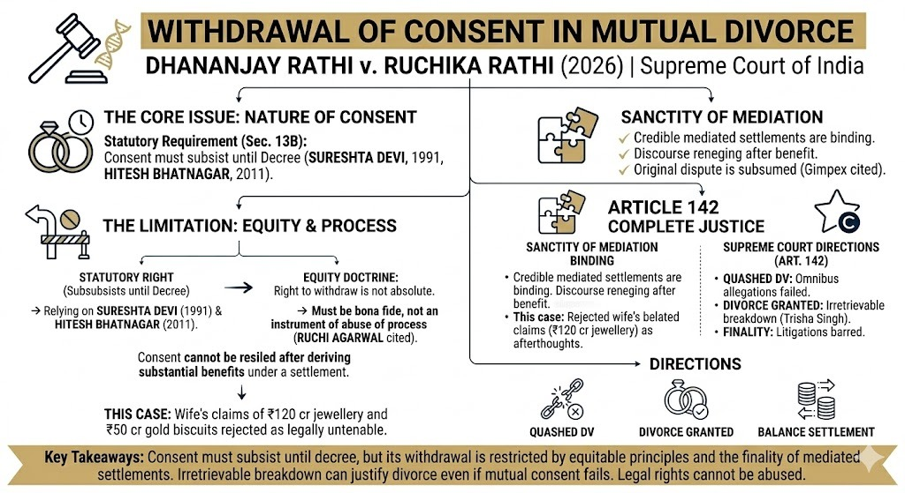

# Withdrawal of Consent in Mutual Divorce: A Critical Analysis of Dhananjay Rathi v. Ruchika Rathi (2026)

## Table of contents

## Abstract

The Supreme Court’s decision in **Dhananjay Rathi v. Ruchika Rathi (2026)** marks a significant development in matrimonial jurisprudence by harmonising three competing principles: 
1. The sanctity of mediated settlement agreements.
2. The statutory requirement of continuing consent in mutual divorce.
3. The Court’s extraordinary powers under Article 142 of the Constitution. 

The judgment reinforces the doctrine that while consent is revocable, such withdrawal must not be permitted to operate as an instrument of abuse of process.

## I. Introduction

The evolving jurisprudence on mutual consent divorce under Section 13-B of the Hindu Marriage Act, 1955 reflects a judicial attempt to balance party autonomy with systemic fairness. The present judgment revisits a recurring conflict: whether a party can resile from a mediated settlement after deriving substantial benefits and whether such withdrawal can defeat the ends of justice.

## II. Factual Matrix

The dispute arose out of matrimonial discord, culminating in:
- Filing of divorce proceedings on grounds of cruelty and adultery.
- Reference to mediation, leading to a Settlement Agreement dated 16.05.2024.
- Filing and allowance of the first motion under Section 13-B(1).
- Subsequent withdrawal of consent by the wife prior to second motion.

The settlement involved substantial financial transactions, including a payment of ₹75 lakhs as a first instalment and ₹14 lakhs towards the purchase of a car. Despite partial compliance, the wife withdrew consent and initiated proceedings under the Domestic Violence Act, 2005.

## III. Issues for Determination

The Supreme Court framed three critical issues:
1. Whether the DV proceedings were liable to be quashed.
2. Whether a party can withdraw from a mediated settlement.
3. Whether Article 142 can be invoked to grant divorce on the ground of irretrievable breakdown.

## IV. Withdrawal of Consent: Statutory Right vs. Abuse of Process

The respondent relied on landmark precedents like *Smt. Sureshta Devi v. Om Prakash (1991)*, which held that consent must subsist until the decree. However, the Court distinguished these, observing that:
- Withdrawal of consent is permissible only when **bona fide**.
- It cannot be exercised after deriving benefits under a settlement.
- It cannot be used as a tool for economic coercion or renegotiation.

**The Court thus introduced an important qualification:** The statutory right to withdraw consent is not absolute when it results in abuse of process.

## V. Sanctity of Mediated Settlements

The Court placed strong reliance on *Ruchi Agarwal v. Amit Kumar Agarwal (2005)* and *Mohd. Shamim v. Nahid Begum (2005)*. These cases establish that:
- Partial compliance with a settlement weakens claims of coercion.
- Courts must discourage parties from reneging after benefiting.
- A mediated settlement subsumes the original dispute, and parties cannot revive litigation arbitrarily.

## VI. Grounds to Resile from Settlement

The Court crystallised the law: A party may withdraw from a settlement **only if**:
- It was obtained by fraud, coercion, or undue influence.
- There is non-performance of agreed terms.

In this case, the wife's retrospective claims about oral promises of massive amounts of jewellery and gold were rejected as afterthoughts.

## VII. Abuse of Domestic Violence Proceedings

A crucial aspect of the judgment is the Court’s approach to DV proceedings. The Court held that:
- Vague and omnibus allegations cannot sustain criminal proceedings.
- Matrimonial disputes should not be converted into tools of harassment.
- The DV proceedings were quashed as an abuse of process.

## VIII. Irretrievable Breakdown and Article 142

The Court invoked its extraordinary powers under Article 142, relying on *Trisha Singh v. Anurag Kumar (2024)*. The Court reiterated that since the marriage was emotionally dead and beyond reconciliation, it could grant a divorce even without mutual consent at the second motion stage.

## IX. Directions Issued by the Court

The Court:
- Quashed DV proceedings.
- Granted divorce under Article 142.
- Directed payment of the balance settlement amount.
- Barred all future litigation arising out of the marriage.

## X. Doctrinal Significance

1. **Qualified Right to Withdraw Consent**: Subtle limits on the *Sureshta Devi* precedent via equitable constraints.
2. **Reinforcement of Mediation**: Strengthens the binding nature of settlement agreements.
3. **Expansion of Article 142**: Continued trend of granting divorce for "complete justice."
4. **Curtailing Misuse of DV Act**: Strong stance against tactical criminal litigation.

## XI. Conclusion

The decision in *Dhananjay Rathi v. Ruchika Rathi* represents a pragmatic evolution of matrimonial law. It strikes a delicate balance between individual autonomy, institutional integrity, and judicial equity. The ruling sends a clear message: **legal rights cannot be exercised in a manner that defeats justice.**

---

**Cause Title: Dhananjay Rathi v. Ruchika Rathi (CRIMINAL APPEAL NO. 1924 OF 2026)**

---

**Advocate Prithwish Ganguli**  
House # 73, near Tank #10, behind Matri Sadan Hospital,  
EE Block, Sector II, Bidhannagar, Kolkata, West Bengal 700091  
**M.:** 99030 16246
