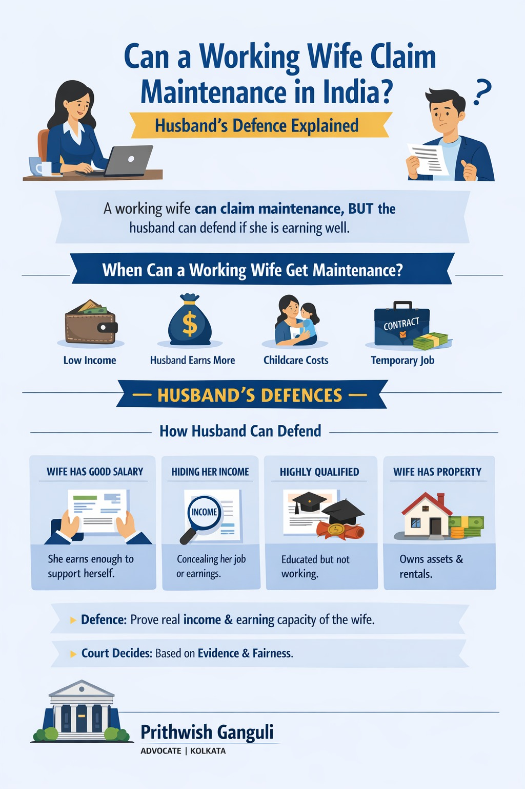

# Can a Working Wife Claim Maintenance in India? Husband’s Defence Explained

## Table of contents

## Introduction

One of the most searched legal questions by husbands facing matrimonial litigation is: **Can a working wife claim maintenance in India?** 

The short answer is yes, in some cases—but not automatically. Merely having a job does not always bar a wife from claiming maintenance. At the same time, if the wife is earning sufficiently, highly qualified, or financially independent, the husband may raise a strong legal defence against the maintenance claim.

Indian courts examine real income, standard of living, reasonable needs, and the comparative financial position of both spouses before deciding maintenance. Therefore, every case depends on evidence, not assumptions.

## Can a Working Wife Claim Maintenance in India?

Yes. A working wife may still claim maintenance under appropriate laws such as:
- Section 144 Bharatiya Nagarik Suraksha Sanhita, 2023
- Section 24 & 25 Hindu Marriage Act, 1955
- Protection of Women from Domestic Violence Act, 2005

However, courts repeatedly hold that employment alone is not decisive. The real question is whether the wife’s income is **sufficient for her support** in the circumstances of the case.

## When Can a Working Wife Still Get Maintenance?

A working wife may still receive maintenance if:
- **✔️ Her Income Is Too Low**: If the salary is insufficient for healthcare, rent, and basic dignity.
- **✔️ Husband Earns Much More**: Where there is a large gap in lifestyle and earning capacity.
- **✔️ Childcare Responsibility**: If the wife is bearing major expenses for children.
- **✔️ Temporary / Unstable Employment**: Contract jobs or irregular freelancing may not defeat a claim.

## Husband’s Defence Explained: How to Oppose a Maintenance Claim

If the wife is employed or capable of earning, the husband can raise lawful defences based on evidence:

### 1. Wife Has Sufficient Independent Income
If the wife earns enough to maintain herself comfortably, maintenance may be reduced or refused.
**Useful evidence:** Salary slips, bank statements, ITRs, or business ownership documents.

### 2. Concealment of Employment
If the wife hides her job, freelancing, or tuition income, the husband can expose this through documents. Courts view concealment of income very seriously.

### 3. Highly Qualified and Deliberately Unemployed
Where the wife is educated and intentionally not working despite clear employability, courts may consider this as a factor for reducing the maintenance amount.

### 4. Wife Has Significant Assets
Ownership of property, rental income, or investments may weaken her claim for support from the husband.

## Important Supreme Court Principle

The Supreme Court of India has emphasized that parties must disclose truthful financial information in maintenance matters. Both parties are now required to file detailed affidavits showing assets, liabilities, salary, and lifestyle evidence.

## Can Maintenance Be Fully Rejected?

Yes. Maintenance may be rejected or nominally fixed where:
- The wife earns sufficiently for her current standard of living.
- Concealment is proved in court.
- No genuine need exists.
- The claim is inflated and unsupported by evidence.

## Conclusion

So, can a working wife claim maintenance in India? Yes—but not as a matter of right in every case. If the wife is earning well, highly employable, or financially secure, the husband has several valid legal defences. Courts focus on fairness, need, and actual evidence.

If you are facing a maintenance case in Kolkata, strategic representation and proper documentation are crucial.

---

**Advocate Prithwish Ganguli**  
House # 73, near Tank #10, behind Matri Sadan Hospital,  
EE Block, Sector II, Bidhannagar, Kolkata, West Bengal 700091  
**M.:** 99030 16246
